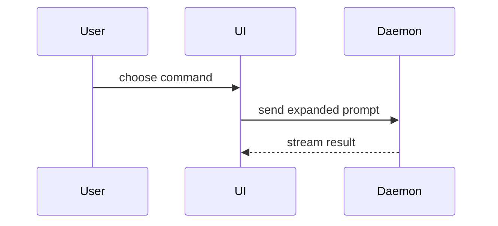

# Show me

Help the user understand the current topic visually. Skip the preamble. Keep prose brief. Pick the smallest view that makes the key point clear.

## Pseudocode

Show logic or an algorithm as pseudocode:

```text
on(save)
  if content is unchanged
    return cached result
  write new content
  return fresh result
```

## Call tree

Show runtime control flow as a call tree:

```text
submitForm
  createSession
    persistPrompt
    launchAgent
  navigateToSession
```

## Component tree

Show UI structure as a component tree. Include state and module boundaries that matter:

```tsx
<SessionPage> (apps/example/src/routes/session.tsx)
  useSessionEvents()
  <SessionToolbar>
    <RunSkillButton> (packages/ui)
```

## File tree

Show file responsibility or a broad refactor as a shallow file tree:

```text
src/
├── commands/       # parses user actions
├── sessions/       # owns session state
└── transport/      # sends API requests
```

## Mermaid

Show component interaction, control flow, or data flow with Mermaid:



## Diff

Use a diff when the point is what changes and the surrounding shape already exists. Match the diff shape to the topic.

## Full block

Show the whole block when most of it is new, when omitted context would hide ownership or order, or when the user needs a copyable target shape.

## Focused HTML

For a visual UI, layout, state comparison, or concept too dense for Mermaid, write one focused HTML file. Match the product's colors, type, spacing, and components. Use real labels and data. Support desktop and mobile.

## Guidance

Place each visual next to the short text it supports. Keep only the calls, files, props, states, and boundaries needed to answer the current question.

You may use one of these. You may use several. You will rarely use all of them. Do not overwhelm the user.

This skill is one-shot visual grammar. It is not multi-session pedagogy. Do not fold teaching plans, missions, or learning records into it.
