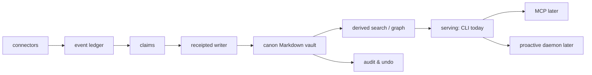

# Kizuki

気づき. Awareness; the moment of realization.

**Your life, queryable as a CLI.** Kizuki is a local-first personal memory
substrate. Connectors capture source-linked evidence into an append-only
ledger. An autonomous loop extracts claims, writes them into a canonical
Markdown vault on the owner's disk with a receipt for every write, and
refreshes retrieval. The owner corrects it in a sentence and undoes any
write by receipt. The CLI queries that vault.

An MCP serving layer for client harnesses is designed
(see [docs/architecture.md](docs/architecture.md)) but not built. Kizuki is
not a harness and hosts no agents. A client harness brings its own loop and
connects here.

Binding direction is [RFC 0002](rfcs/0002-autonomous-canon.md). See
[docs/CURRENT.md](docs/CURRENT.md).

## How it works

```
connectors
  → event ledger
  → claims (provenance · confidence · sensitivity)
  → canon Markdown vault
  → derived (search / graph)
  → audit & undo
  → serving (CLI today; MCP later)
  → proactive daemon (later)
```



Capture never writes canon directly. The receipted writer does,
and every write it makes can be undone by receipt. Search and
graph are disposable. They rebuild from the ledger plus canon.

## Packages

One Bun workspace. Five packages. There is no MCP package.

- **`@kizuki/core`** owns the durable contracts and policy boundary: event
  ingest, the append-only ledger, connection state, claims, the receipted
  canon writer, undo, the Markdown vault, FTS search, graph, timeline, purge
  with receipts, and agent identity, grants, and audit.
- **`@kizuki/cli`** is a thin command-line composition over public core and
  connector APIs. Implemented verbs on this branch: `init`, `connect`,
  `backfill`, `sync`, `import`, `models`, `audit`, `undo`, `query`,
  `doctor`, `purge`, `export`, `version`. `models pull --from PATH` copies
  a local GGUF into the vault models directory and reports sha256; it
  verifies that digest only when `--sha256 HEX` is given. It does not
  download weights. Leftover Wave 1 verbs `review`, `promote`, and
  `reject` still run; they are not the product gate. Accepted design
  verbs, not built: `tell`, `context`, `timeline`, `rebuild`, `serve`.
- **`@kizuki/connectors`** owns the connector interface, the in-tree
  registry, and the shared conformance suite. Registry today:
  `kizuki.markdown-folder`, `kizuki.import-chatgpt`, `kizuki.import-claude`.
  All three read local files. No sign-in or OAuth connector is built.
- **`@kizuki/embed-gguf`** is the optional local embedding port
  (`kizuki.embedding.gguf`). It loads an owner-supplied GGUF from a pinned
  path, records space identity, and embeds in-process. It does not download
  weights on the read path.
- **`@kizuki/tui`** is the audit and undo interface: pure state transitions and
  rendering, with terminal I/O at the edge. The leftover CLI `review` verb
  still opens it when stdin and stdout are a terminal.

## Data contracts

- **Ingest.** Connectors emit `kizuki.event/v1`. The spine accepts an event
  as stored, duplicate, or error. Dedupe is
  `(connector_id, source_record_id, content_hash)`. The spine assigns
  `event_id` and `content_hash`. Callers cannot supply them.
- **Canon writes.** `kizuki.claim/v1` is the durable record; the compat
  `proposals` table is still dual-written on this branch. Only the receipted
  writer in `@kizuki/core` (`applyCanonWrite`) writes canon: page file, then
  JSONL receipt, then `canon_receipts` row, with before/after hashes of the
  bytes on disk and a capability that only that module can mint. Agents
  propose claims and relay corrections; they cannot put a page. The leftover
  `ownerPromote` path is a shim over the same writer (`writer: "import"`).
- **Derived.** Search (SQLite FTS5) and graph edges rebuild from the ledger
  plus canon. `rebuildDerived` is the library call. The CLI indexes search
  after each ingest and leftover promote; there is no CLI rebuild verb yet, and the
  graph is not indexed on the write path.
- **Fail closed.** A missing sensitivity label is not served. Missing
  connector credentials refuse. An unknown agent gets no access.
  Enforcement lives in core authorization and search. The CLI `query` verb
  searches through core with a `private` ceiling, so unlabeled pages and
  events are withheld and counted on stderr.

The frozen contracts and invariants are in
[docs/architecture.md](docs/architecture.md). Merged RFCs under `rfcs/`
bind only when their status says they do. RFC 0002 is BINDING.

## Pledges

- **Free local forever.** The local product is MIT. Recall is never metered.
- **Zero phone-home.** No telemetry, no crash reports, no update checks. The
  only network calls are the owner's configured connectors and the owner's
  configured model endpoint. Direct network egress exists only in files
  listed in `scripts/network-allowlist.txt`, each with a reason. CI fails on
  any other network surface, and on a stale allowlist entry. Core has zero
  runtime dependencies. The packages that open a socket to a provider are
  the Telegram connector, through the `telegram` (GramJS) library, and the
  IMAP and ICS connectors over TLS, each only after you sign in or point it
  at a calendar you configured.
- **Your files.** Canon is Markdown on the owner's disk. Deleting Kizuki
  leaves a readable vault.
- **Nothing writes canon without a receipt.** Every write names its evidence, its
  confidence and its writer, and `kizuki undo` reverses it.

## Retrieval credit

The hybrid retrieval recipe Kizuki will reimplement — reciprocal rank
fusion, layered near-duplicate filtering, and tier-weighted finalization —
is documented in [GBrain](https://github.com/garrytan/gbrain). Kizuki does
not depend on that project today. The accepted design is a clean
reimplementation with prominent credit; a permitted fork remains open for
the entity graph only. That project is not on a package registry Kizuki can
depend on, has no reranker, and has no local GGUF path. See
[docs/upstream-policy.md](docs/upstream-policy.md).

## Try it (pre-alpha)

Pre-alpha. This README claims only what runs on this branch. Nothing is
packaged or installable. There is no compiled binary and no registry
release. Below, `kizuki` stands for `bun packages/cli/src/main.ts` run from
the tree.

Config lives at `$KIZUKI_CONFIG`, else `$XDG_CONFIG_HOME/kizuki/config.toml`,
else `$HOME/.config/kizuki/config.toml`. Only `default_vault` and named
`[vaults]` are read. Every verb accepts `--vault <path|name>`.

Implemented verbs:

- `init` — create a vault and set `default_vault` when none is configured
- `connect` — enroll a local-folder source as an opaque connection
- `backfill` — historical sweep for one selected connection
- `sync` — incremental sweep for one, some, or every active connection
- `import` — connect plus backfill in one step
- `query` — full-text search over labeled canon and ledger text
- `doctor` — report vault, connection, receipt, and hold health
- `purge` — physically delete matching events, with a receipt
- `export` — dump vault files and ledger tables to a directory
- `version` — print the CLI package version

Leftover Wave 1 verbs, not the product gate: `review`, `promote`, `reject`.
They still run. RFC 0002 retires them as the owner path.

Accepted design, not built: `audit`, `tell`, `undo`, `context`, `timeline`,
`rebuild`, `models`, `serve`.

Unlabeled capture is never served by `query`. Sign-in connectors are not
wired yet.

```
kizuki init ./vault
kizuki import markdown-folder --source ./notes
kizuki query acme
kizuki doctor
kizuki export --out ./export
```

Two migration importers move a previous personal-knowledge estate in: a
markdown wiki and a SQLite/JSONL event table, both driven by owner-written
mapping files. See [docs/legacy-import.md](docs/legacy-import.md).

Designed, not built (see [docs/architecture.md](docs/architecture.md)):

- MCP serving, `correct`, and a standing serve daemon
- Conversational correction (`kizuki tell`) and receipted undo
- Sign-in and OAuth connectors
- A compiled binary and an install path
- CLI verbs for audit, rebuild, models, timeline, and context packets

## Develop

Requires [Bun](https://bun.sh). CI pins 1.3.10. TypeScript is strict.

```
bun install --frozen-lockfile
bun run typecheck
bun test
bun run verify
```

`bun run verify` is the full gate: frozen install, typecheck, tests, and
the policy and network scanners.

The CLI is not installed. Run it from the tree:

```
bun packages/cli/src/main.ts version
```

## Security

Captured text, metadata, filenames, archives, and provider responses are
attacker-controlled input. Unlabeled pages and events are not served by the
authorization engine. Credentials stay behind `env:` and `file:` secret
references. They are never persisted as plaintext in SQLite, logs, fixtures,
or Markdown.

The threat model and the fourteen invariants live in
[docs/architecture.md](docs/architecture.md).

## License

[MIT](LICENSE).
