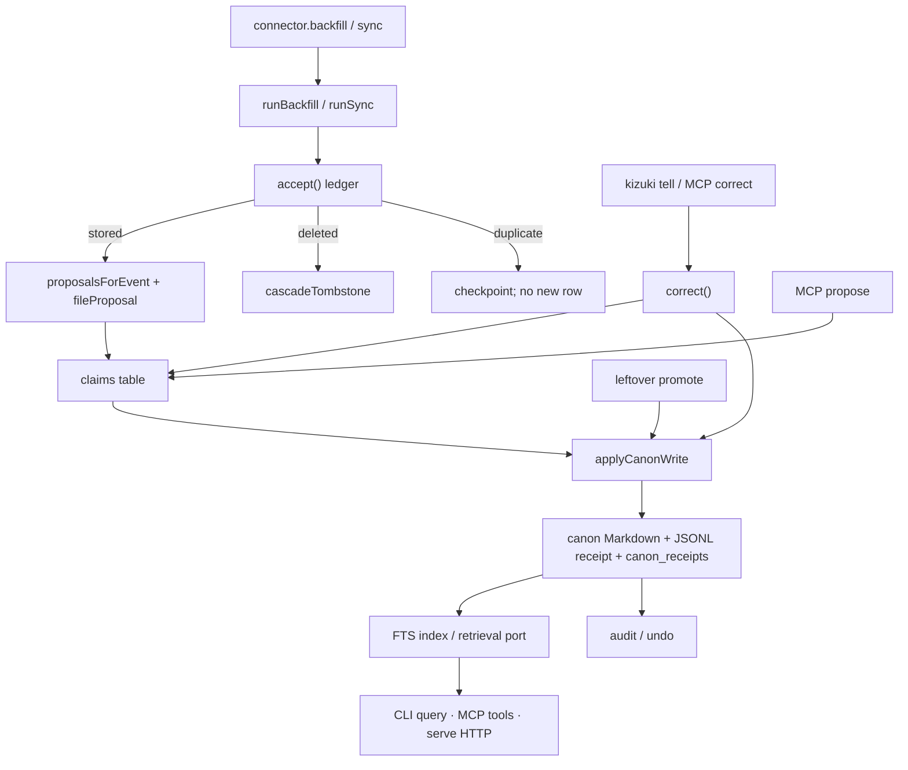

# Kizuki

気づき. Awareness; the moment of realization.

Kizuki is a local-first personal LifeOS: an append-only ledger of source-linked
claims about one life, written into Markdown canon on the owner's disk. It is
not a chatbot zoo. It hosts no agents.

Binding direction: [RFC 0002](rfcs/0002-autonomous-canon.md). Live intent:
[docs/CURRENT.md](docs/CURRENT.md).

## What it is

```text
evidence (connectors)
  → ledger (kizuki.event/v1)
  → claims (kizuki.claim/v1 · provenance · confidence · sensitivity · authority)
  → receipted writer (applyCanonWrite)
  → canon (Markdown on disk)
  → derived (FTS / retrieval port)
  → serve (CLI · MCP · loopback HTTP)
  → correction (tell / correct) and undo (receipt)
```

Capture never writes a page. `applyCanonWrite` in `@kizuki/core` does. Every
write has a receipt. `kizuki undo <receipt>` reverses it. Owner correction
outranks every other authority tier.

## File tree

One Bun workspace. Twelve packages. Paths are real.

```text
packages/
├── core/                  # contracts, ledger, claims, receipted writer,
│                          # vault, serving, serve rails, agents, purge
├── cli/                   # kizuki verbs over public core + connector APIs
├── connectors/            # registry + file importers + conformance suite
├── connector-telegram/    # kizuki.telegram (sign_in)
├── connector-imap/        # kizuki.imap (sign_in)
├── connector-ics/         # kizuki.ics (none | sign_in)
├── connector-screenpipe/  # kizuki.screenpipe (none)
├── mcp/                   # stdio MCP adapter; no policy of its own
├── llm/                   # kizuki.llm.none + kizuki.llm.openai-compatible
├── embed-gguf/            # kizuki.embedding.gguf (owner-supplied GGUF)
├── retrieval-pg/          # kizuki.retrieval.embedded-pg (graph + lease)
└── tui/                   # audit / undo UI; reducer emits only undo
docs/                      # architecture, CURRENT, decision log
rfcs/                      # 0000 constraints · 0001 arbitration · 0002 BINDING
scripts/                   # verify, denylist, network allowlist
.agents/skills/            # canonical agent playbooks
.claude/skills/            # Claude adapters + show-me
.cursor/skills/            # Cursor skills (show-me)
```

## Data flow

Ingest, claims, ledger, correction, and authority as the code actually runs.



Authority on a claim (`AUTHORITY_TIERS` in `packages/core/src/contracts/proposal.ts`):

```text
owner_correction  4   # tell / correct; supersedes in the same pass
owner_authored    3
connector_evidence 2  # ingest from a source
model_inference   1
```

A missing sensitivity label is not served. Unlabeled pages and events are
withheld by `query` (ceiling `private`) and counted on stderr.

## Call tree

The CLI entry is `packages/cli/src/main.ts`. `kizuki` means
`bun packages/cli/src/main.ts` from this tree. Nothing is packaged.

```text
dispatch(argv)
  extractVault / COMMANDS.find
  command.run
    init
      initVault
      writeConfig(default_vault)
      installServeService          # unless --no-service or no supervisor
    import | connect + backfill | sync
      resolveConnectorId
      getConnector / loadConnector
      enrollHostConnection         # none-mode only; sign-in not wired
      runBackfill | runSync
        connector.backfill | connector.sync
        accept
        proposalsForEvent / fileProposal | cascadeTombstone
        saveCheckpoint
      indexEventsSince
    tell
      correct
        acceptOwnerEvent
        insertCorrection
        supersedeLiveGroup
        applyCanonWrite
    query
      search(db, text, { ceiling: "private" })
    serve
      runServeDaemon
        acquireLease(writer)
        startServeHttp             # loopback; --no-http skips
        dueRails → runRail
          sync | retrieval-sweep | purge-sweep
          embed-backfill | brief | doctor-sweep | journal-prune
    undo → undoReceipt
    audit → listAuditReceipts | runAudit (TUI)
    doctor → doctorVault + inspectServeDoctor + inspectPurgeHealth
    purge → runPurge | verifyPurge
    models pull --from PATH        # copies a local GGUF; does not download
```

MCP is a separate process, not a CLI verb:

```text
bun packages/mcp/src/bin.ts --vault PATH (--owner | --token-env VAR)
  openLedger
  runStdio → createServer
    search | get_page | query_entities | timeline
    context_packet | graph_neighbors | system_health
    propose | correct
```

## 1.0 vs this revision

**1.0 is not tagged.** Decision C1 and RFC 0002 §1.3 define 1.0 as both
proofs: a stranger can install, connect a source, and get value; the owner's
estate is cut over. Neither proof is in this tree. There is no
`scripts/stranger-proof.sh` and no GO/NO-GO script. The stranger-proof spec
is VOID as written.

What this revision does have:

| Surface | State on this revision |
| --- | --- |
| RFC 0002 lanes | Code exists for contracts, claims, writer, undo/audit, llm, producer, correction, sensitivity, FTS retrieval, retrieval-pg, embed-gguf, serve, purge. Lane exit proofs (seven-day receipts, stranger loop, cutover) are not claimed. |
| `kizuki doctor` | Reports vault pages, connections, receipts, holds, purge SLA, serve rails, and `canon writing: on\|off`. Off when no model is configured. |
| Denylist | `scripts/verify.sh` fails on forbidden identifiers in tracked text and reachable commit messages, and on network calls outside `scripts/network-allowlist.txt`. |
| Cutover | Estate importers exist (`kizuki.import-legacy-wiki`, `kizuki.import-legacy-events`). Parallel-run cutover is not done. |
| Leftover verbs | `review`, `promote`, `reject` still run. They are not the owner path. |
| Not built as CLI verbs | `context`, `timeline`, `rebuild`. Those reads exist as MCP/core serving functions. |
| Sign-in | Connector packages exist. `kizuki connect` / `import` enroll `none`-mode sources only and say `sign-in … is not wired yet`. |
| Release | CLI version `0.1.0`. No compiled binary. No registry package. |

## How to start

Requires [Bun](https://bun.sh). CI pins **1.3.10**. TypeScript is strict.

Config is `$KIZUKI_CONFIG`, else `$XDG_CONFIG_HOME/kizuki/config.toml`, else
`$HOME/.config/kizuki/config.toml`. Only `default_vault` and named
`[vaults]` are read. Every verb accepts `--vault <path|name>`.

```text
bun install --frozen-lockfile
bun packages/cli/src/main.ts init ./vault
bun packages/cli/src/main.ts import markdown-folder --source ./notes
bun packages/cli/src/main.ts query acme
bun packages/cli/src/main.ts doctor
bun packages/cli/src/main.ts tell "the name is Ada" --claim CLAIM_ID
bun packages/cli/src/main.ts undo RECEIPT_ID
```

`none`-mode registry ids (CLI will enroll these):

```text
kizuki.markdown-folder
kizuki.import-chatgpt
kizuki.import-claude
kizuki.import-whatsapp
kizuki.import-pocket
kizuki.import-omnivore
kizuki.import-legacy-wiki
kizuki.import-legacy-events
kizuki.screenpipe
kizuki.ics                 # also declares sign_in; CLI uses none
```

Registered, not enrollable through this CLI: `kizuki.telegram`, `kizuki.imap`.

Two migration importers move a previous personal-knowledge estate in: a
markdown wiki and a SQLite/JSONL event table, both driven by owner-written
mapping files. See [docs/legacy-import.md](docs/legacy-import.md).

Verify:

```text
bun run typecheck
bun test
bun run verify             # install, typecheck, tests, policy, network, denylist
```

## What this is not

- **Not a CRM.** It stores claims about a life, not a sales pipeline.
- **Not a second wiki.** Canon is Markdown the loop writes from evidence. You
  can edit the files; the loop treats those edits as your word.
- **Not an agent harness.** No hosted loop. A client brings its own loop and
  connects here (CLI today; MCP stdio or `kizuki serve` loopback HTTP).

## Contracts that bind

- **Ingest.** Connectors emit `kizuki.event/v1`. `accept` returns stored,
  duplicate, or error. Dedupe is `(connector_id, source_record_id, content_hash)`.
  The spine assigns `event_id` and `content_hash`.
- **Canon.** Only `applyCanonWrite`. Page file, then JSONL receipt, then
  `canon_receipts` row, with before/after hashes. Agents propose and relay
  corrections; they cannot put a page.
- **Derived.** Disposable. FTS is indexed after ingest. `rebuildDerived` is a
  library call. There is no `kizuki rebuild` verb.
- **Network.** No phone-home. Egress only from files in
  `scripts/network-allowlist.txt` (model transport, ICS fetch, IMAP TLS,
  OAuth loopback, serve HTTP). CI fails on any other surface.
- **Secrets.** `env:` and `file:` references only. Never plaintext in SQLite,
  logs, fixtures, or Markdown.

Invariants: [docs/architecture.md](docs/architecture.md).

## Retrieval credit

The hybrid retrieval recipe — reciprocal rank fusion, layered near-duplicate
filtering, and tier-weighted finalization — is documented in
[GBrain](https://github.com/garrytan/gbrain). Kizuki does not depend on that
project. The accepted design is a clean reimplementation with prominent
credit; a permitted fork remains open for the entity graph only. See
[docs/upstream-policy.md](docs/upstream-policy.md).

## License

[MIT](LICENSE). Free local forever. Recall is never metered.
