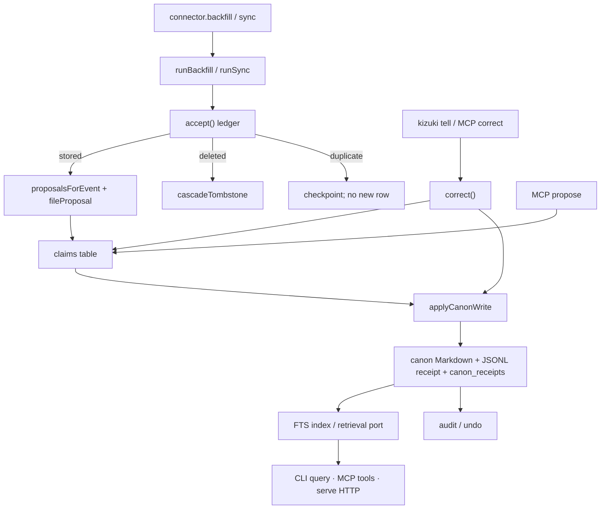

# Kizuki

**Local-first LifeOS.** Source-linked claims about one life, written into
receipted Markdown canon on the owner's disk.

[](LICENSE)
[](.github/workflows/ci.yml)
[](https://bun.sh)

Kizuki is not a chatbot, not an agent harness, and not a messaging gateway.
Connectors and imports produce evidence. Evidence enters an append-only ledger,
is extracted into claims, and reaches durable Markdown through one receipted
writer. The owner's leverage is correction and undo, not approval.

Capture never writes a page. Only `applyCanonWrite` does. Every write has a
receipt. `kizuki undo <receipt>` reverses it. Owner correction outranks every
other authority tier. A missing sensitivity label is not served.

This revision is **not 1.0**. A stranger can run the loop below. Estate cutover
and a stranger-proof installer are not done.

## What runs on this revision

| Surface | State |
| --- | --- |
| CLI | `bun packages/cli/src/main.ts` — verbs listed below. No compiled binary. No registry package. Version `0.1.0`. |
| File ingest | `import` / `connect` enroll `none`-mode sources only. |
| Query | FTS over labeled canon and ledger text. Unlabeled hits are withheld. |
| Doctor | Vault, connections, claims, receipts, holds, serve rails, `canon writing: on\|off`. |
| Correction | `tell` / MCP `correct` supersede a claim and rewrite canon in the same pass. |
| Undo / audit | Receipt list, TUI audit, `undo <receipt>`. |
| Serve | Local loop, loopback HTTP, optional user-service install at `init`. |
| MCP | `bun packages/mcp/src/bin.ts` — stdio adapter. No policy of its own. |
| Sign-in sources | Telegram and IMAP packages exist. This CLI will not enroll them. |
| Canon writer | Requires a configured model. Without one, doctor says so and the rest still runs. |
| 1.0 proofs | Not claimed. No `scripts/stranger-proof.sh`. |

Public CLI verbs: `init`, `connect`, `backfill`, `sync`, `import`, `models`,
`audit`, `tell`, `undo`, `query`, `doctor`, `serve`, `purge`, `export`,
`version`. `review`, `promote`, and `reject` are retired: they exit 2 and
point at `audit`, `undo`, and `tell`.

## Quick start

Requires [Bun](https://bun.sh) **1.3.10** (the version CI pins). TypeScript is
strict. Nothing is installed globally. From a clone:

```bash
bun install --frozen-lockfile
bun packages/cli/src/main.ts init ./vault
bun packages/cli/src/main.ts import markdown-folder --source ./notes
bun packages/cli/src/main.ts query acme
bun packages/cli/src/main.ts doctor
```

Config is `$KIZUKI_CONFIG`, else `$XDG_CONFIG_HOME/kizuki/config.toml`, else
`$HOME/.config/kizuki/config.toml`. Only `default_vault` and named `[vaults]`
are read. Every verb accepts `--vault <path|name>`.

`import` stores events and files claims. It does not write canon. `query` of
unlabeled ledger text prints nothing on stdout and reports `withheld=N` on
stderr — that is fail-closed, not a broken search. `doctor` lists filed
(ingest) claims and live claims separately. `tell --claim` needs a **live**
claim; after a folder import those rows are filed, not live, until the
receipted writer runs (a configured model) or a prior correction minted one.

```bash
bun packages/cli/src/main.ts tell "the name is Ada" --claim LIVE_CLAIM_ID
bun packages/cli/src/main.ts undo RECEIPT_ID
```

Without a model, ingest, query, doctor, and undo still run. `tell` still
runs without a model once a live claim exists. The loop will not write
canon on its own.

## How to use

```text
bun packages/cli/src/main.ts help
bun packages/cli/src/main.ts help <verb>
```

| Job | Verb |
| --- | --- |
| Create a vault | `init <path>` |
| Ingest a folder or export | `import <connector> --source PATH` |
| Search labeled text | `query <text>` |
| Health | `doctor` |
| Correct a claim | `tell "<statement>" --claim CLAIM_ID` |
| Reverse a write | `undo <receipt_id>` |
| Inspect receipts | `audit` (`--list` or `--json` without a TTY) |
| Incremental sync | `sync` |
| Local loop | `serve` (loopback HTTP unless `--no-http`) |
| Delete with a receipt | `purge --event\|--subject\|--connector … --reason TEXT` |
| Leave | `export --out DIR` |

File sources this CLI will enroll:

```text
kizuki.markdown-folder
kizuki.import-chatgpt
kizuki.import-claude
kizuki.import-whatsapp
kizuki.import-pocket
kizuki.import-omnivore
kizuki.import-legacy-wiki
kizuki.import-legacy-events
kizuki.screenpipe
kizuki.ics                 # also declares sign_in; CLI uses none
```

Registered, not enrollable here: `kizuki.telegram`, `kizuki.imap`.

Two migration importers move a previous personal-knowledge estate in: a
markdown wiki and a SQLite/JSONL event table, both driven by owner-written
mapping files. See [docs/legacy-import.md](docs/legacy-import.md).

MCP (separate process):

```bash
bun packages/mcp/src/bin.ts --vault PATH --owner
```

Read tools: `search`, `get_page`, `query_entities`, `timeline`,
`context_packet`, `graph_neighbors`, `system_health`. Write tools: `propose`,
`correct`. There is no `put_page`.

Verify:

```bash
bun run verify             # install, typecheck, tests, policy, network, denylist
```

## Architecture

Evidence in. Receipted Markdown out. Derived layers are disposable.

```text
packages/
├── core/                  # contracts, ledger, claims, receipted writer,
│                          # vault, serving, serve rails, agents, purge
├── cli/                   # kizuki verbs over public core + connector APIs
├── connectors/            # registry + file importers + conformance suite
├── connector-telegram/    # kizuki.telegram (sign_in; not CLI-enrollable)
├── connector-imap/        # kizuki.imap (sign_in; not CLI-enrollable)
├── connector-ics/         # kizuki.ics (none | sign_in)
├── connector-screenpipe/  # kizuki.screenpipe (none)
├── mcp/                   # stdio MCP adapter; no policy of its own
├── llm/                   # kizuki.llm.none + kizuki.llm.openai-compatible
├── embed-gguf/            # kizuki.embedding.gguf (owner-supplied GGUF)
├── retrieval-pg/          # kizuki.retrieval.embedded-pg (graph + lease)
└── tui/                   # audit / undo UI; reducer emits only undo
docs/                      # architecture, CURRENT, decision log, CLI
rfcs/                      # 0000 constraints · 0001 arbitration · 0002 BINDING
scripts/                   # verify, denylist, network allowlist
```



Authority on a claim (`AUTHORITY_TIERS` in `packages/core/src/contracts/proposal.ts`):

```text
owner_correction  4   # tell / correct; supersedes in the same pass
owner_authored    3
connector_evidence 2  # ingest from a source
model_inference   1
```

```text
dispatch(argv)
  extractVault / COMMANDS.find
  command.run
    init → initVault + optional installServeService
    import | connect + backfill | sync
      enrollHostConnection          # none-mode only
      runBackfill | runSync → accept → fileProposal | cascadeTombstone
    tell → correct → acceptOwnerEvent + applyCanonWrite
    query → search(..., { ceiling: "private" })
    serve → runServeDaemon → startServeHttp + dueRails
    undo → undoReceipt
    audit → listAuditReceipts | runAudit
    doctor → doctorVault + claims + inspectServeDoctor
```

Invariants, storage, and the frozen ingress live in
[docs/architecture.md](docs/architecture.md). Binding intent:
[docs/CURRENT.md](docs/CURRENT.md) and
[RFC 0002](rfcs/0002-autonomous-canon.md).

## Documentation

| Start here | What it is |
| --- | --- |
| [Quick start](#quick-start) | Clone → init → import → query → doctor |
| [docs/cli.md](docs/cli.md) | Every public verb, flag, exit code |
| [docs/architecture.md](docs/architecture.md) | Invariants, layers, contracts |
| [docs/CURRENT.md](docs/CURRENT.md) | Binding product intent |
| [rfcs/0002-autonomous-canon.md](rfcs/0002-autonomous-canon.md) | BINDING law for autonomous canon |
| [SECURITY.md](SECURITY.md) | Threat model and reporting |
| [CONTRIBUTING.md](CONTRIBUTING.md) | Verify path, Bun 1.3.10, isolation |

## What this is not

- **Not a CRM.** Claims about a life, not a sales pipeline.
- **Not a second wiki.** Canon is Markdown the loop writes from evidence. You
  can edit the files; the loop treats those edits as your word.
- **Not an agent harness.** No hosted loop. A client brings its own loop.
- **Not a packaged binary.** `npm i -g kizuki` is not a supported install.

## Contracts that bind

- **Ingest.** Connectors emit `kizuki.event/v1`. `accept` returns stored,
  duplicate, or error. Dedupe is `(connector_id, source_record_id, content_hash)`.
- **Canon.** Only `applyCanonWrite`. Page file, then JSONL receipt, then
  `canon_receipts` row, with before/after hashes.
- **Derived.** Disposable. FTS is indexed after ingest. `rebuildDerived` is a
  library call. There is no `kizuki rebuild` verb.
- **Network.** No phone-home. Egress only from files in
  `scripts/network-allowlist.txt`. CI fails on any other surface.
- **Secrets.** `env:` and `file:` references only. Never plaintext in SQLite,
  logs, fixtures, or Markdown.

## Retrieval credit

The hybrid retrieval recipe — reciprocal rank fusion, layered near-duplicate
filtering, authority-weighted finalization, and the entity-graph walk — is
a permitted fork of [GBrain](https://github.com/garrytan/gbrain) at public
commit `8c70f6255047a7647adb30b1d6333a48068d9fa5`, vendored under
`packages/retrieval-pg/vendor/`. Kizuki does not depend on that project as a
registry package. Rerank and local GGUF remain Kizuki's own work. See
[docs/upstream-policy.md](docs/upstream-policy.md).

## License

[MIT](LICENSE). Free local forever. Recall is never metered.
