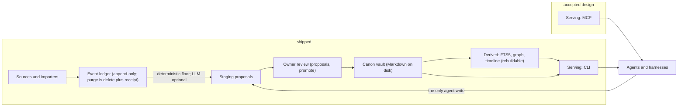
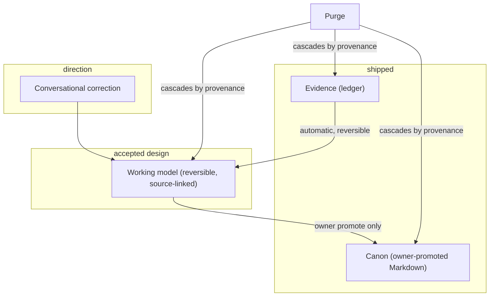
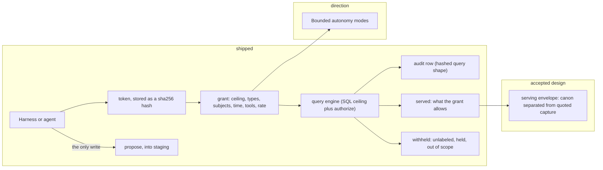
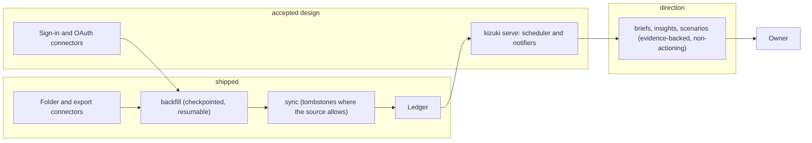

# Kizuki

気づき. Awareness; the moment of realization.

Your life, queryable as a CLI and MCP. Local-first; not a harness; hosts no
agents. The MCP half is designed and not built, which is what the tables below
are for: every row that claims something runs names the test that proves it.

Pre-alpha. No packaged releases yet; run from source with Bun (see
[Try it](#try-it-pre-alpha)).

## Pledges

| Pledge                       | What it means                                                                                      | Proof                                                                                               |
| ---------------------------- | -------------------------------------------------------------------------------------------------- | --------------------------------------------------------------------------------------------------- |
| Free local forever           | The local product is MIT and recall is never metered                                               | `LICENSE`                                                                                           |
| Zero phone-home              | There is no network call anywhere under `packages/`; CI scans every source file and every manifest | `run: bun scripts/verify-network.ts`, `scripts/verify.sh::phone-home dependency`                    |
| Your files                   | Canon is Markdown on your disk; deleting Kizuki leaves a readable vault                            | `packages/core/test/export.test.ts::copies ordinary vault files but excludes the control directory` |
| Nothing writes canon but you | Agents and automation may only propose; one owner-invoked path writes canon                        | `packages/core/test/staging/invariants.test.ts::the promote path is the only door to canon`         |

Runtime dependencies, per package, today: `@kizuki/core` has none, and
`@kizuki/cli`, `@kizuki/connectors`, `@kizuki/connector-screenpipe` and
`@kizuki/tui` depend only on other packages in this workspace. TypeScript is a
development dependency.

## How it works

Evidence moves in one direction and stops at a door only you open. Connectors
and importers capture source-linked evidence into an append-only ledger.
Deterministic staging turns that evidence into proposals. You review the
proposals and promote the ones you accept into a Markdown vault on your own
disk. Search, graph and timeline are derived from the ledger plus canon, and
can be deleted and rebuilt.



Underneath that path sits a three-layer view of knowledge: evidence, a working
model, and canon. Evidence and canon exist today. The working model is the
reversible layer between them, accepted for 1.0 and not written yet.



Those two layers pull against each other. Owner-gated canon and the ban on
silent canon merges stay in force for high-impact truth, while beneath canon a
reversible working model may update automatically. Where exactly the boundary
between the two sits is an explicit non-decision; see
[the current design tension](docs/product-context.md#the-current-design-tension).

Agents are clients with a token, a grant and an audit trail, and exactly one
way to write.



Ingestion is progressive, and the proactive layer that would push you a brief
is designed but not running.



## What runs today

Every row below is proved by a test or a command on this revision. Read `::` as
"this file contains this exact test title".

**Foundation**

| Capability                      | What it means                                                                                                                                    | Proof                                                                                                                                                                                                                                    |
| ------------------------------- | ------------------------------------------------------------------------------------------------------------------------------------------------ | ---------------------------------------------------------------------------------------------------------------------------------------------------------------------------------------------------------------------------------------- |
| Frozen contracts                | `kizuki.event/v1`, `kizuki.proposal/v1` and `kizuki.connector/v1` are validated at the boundary; a caller cannot supply the spine's own fields   | `packages/core/test/event.test.ts::drops unknown keys, including a caller-supplied content_hash`, `packages/core/test/proposal.test.ts::reports every broken field at once`                                                              |
| Append-only ledger              | Accept returns stored, duplicate or error; dedupe is by connector, source record and content hash; a source deletion is stored as a tombstone    | `packages/core/test/ledger.test.ts::deduplicates the same source version`, `packages/core/test/ledger.test.ts::stores and reads a tombstone`                                                                                             |
| Deterministic staging           | Accepted events file proposals with no model configured, and a tombstone withdraws the proposals that cited it                                   | `packages/core/test/ingest.test.ts::accepts events and files deterministic proposals`, `packages/core/test/ingest.test.ts::a tombstone withdraws proposals from prior source versions`                                                   |
| Captured text stays quoted      | A capture note keeps source text inside a blockquote and cannot break out into canon prose                                                       | `packages/core/test/staging/producers.test.ts::captured text cannot escape the quote into canon prose`                                                                                                                                   |
| Owner promote is the only door  | No module other than the promote path can write canon, checked by reading the source tree                                                        | `packages/core/test/staging/invariants.test.ts::the promote path is the only door to canon`                                                                                                                                              |
| Promote for every proposal kind | New page, edit, merge, deletion and purge review all promote, each with a receipt whose hashes match the bytes on disk                           | `packages/core/test/staging/promote-kinds.test.ts::edit replaces body, overlays frontmatter, preserves id, and unions sources`, `packages/core/test/staging/promote.test.ts::the JSONL line and promotions row agree with the page hash` |
| Fail closed on labels           | A page with no sensitivity label is refused at promote rather than defaulted                                                                     | `packages/core/test/staging/promote-kinds.test.ts::an unlabeled page fails closed unless sensitivity is supplied`                                                                                                                        |
| Vault init, frontmatter, doctor | Init creates the layout and ignores its own database in Git; doctor reports every malformed page instead of aborting                             | `packages/core/test/vault.test.ts::self-ignores the database directory in Git`, `packages/core/test/vault.test.ts::reports every canon page and counts an invalid seed`                                                                  |
| Purge with receipts and holds   | Purge is physical deletion plus a receipt; it withdraws proposals, clears derived rows, and holds affected canon until you promote the redaction | `packages/core/test/purge.test.ts::files one purge review and hold without changing promoted canon`, `packages/core/test/purge.test.ts::removes matching derived search and graph rows through real schemas`                             |
| Export                          | `kizuki export` copies the vault and streams the ledger with a manifest whose hashes match the bytes written     | `packages/core/test/export.test.ts::every manifest hash matches the bytes written`, `packages/core/test/export.test.ts::copies ordinary vault files but excludes the control directory`                                                  |
| Opaque connection state         | Connector state is written to a mode 0600 file through a trusted host writer; the bytes never enter SQLite                                       | `packages/core/test/connections.test.ts::raw SQLite never contains state bytes`, `packages/core/test/connections.test.ts::forged handles and malformed rows fail closed`                                                                 |
| Schema migrations               | A v1 database upgrades to v2 without losing events or promotion hashes                                                                           | `packages/core/test/migration.test.ts::upgrades v1 without losing events or promotion hashes`                                                                                                                                            |

**Retrieval**

| Capability                               | What it means                                                                                                     | Proof                                                                                                                                                                                                           |
| ---------------------------------------- | ----------------------------------------------------------------------------------------------------------------- | --------------------------------------------------------------------------------------------------------------------------------------------------------------------------------------------------------------- |
| Full-text search with the ceiling in SQL | FTS5 over canon and ledger; the sensitivity ceiling is a SQL condition, not a filter applied afterwards           | `packages/core/test/search/search.test.ts::personal ceiling hides private and unlabeled documents`, `packages/core/test/search/search.test.ts::public ceiling hides personal, private, and unlabeled documents` |
| Graph edges and neighbours               | Wikilinks, subjects and sources become edges; traversal is bounded and reports truncation instead of running away | `packages/core/test/graph/graph.test.ts::returns incoming and outgoing edges at depth one`, `packages/core/test/graph/graph.test.ts::bounds fan-out and reports truncation`                                     |
| Timeline over the ledger                 | Filter by connector, kind and time window, with a stable order and a bounded preview                              | `packages/core/test/query/timeline.test.ts::filters connector, kind, since, and until together`, `packages/core/test/query/timeline.test.ts::collapses preview whitespace and bounds it to 160 characters`      |
| Rebuildable derived state                | Delete every derived table and one call restores identical counts from ledger plus canon. The CLI indexes search after each ingest and promote; the graph is not indexed on the write path                          | `packages/core/test/derived.test.ts::restores identical counts after every derived table is deleted`                                                                                                            |

**Agents**

| Capability                          | What it means                                                                                                                                                | Proof                                                                                                                                                                                  |
| ----------------------------------- | ------------------------------------------------------------------------------------------------------------------------------------------------------------ | -------------------------------------------------------------------------------------------------------------------------------------------------------------------------------------- |
| Identity and one-time tokens        | A token is shown once and stored only as a hash; rotation invalidates the old one                                                                            | `packages/core/test/agents/identity.test.ts::never stores the token in the database file`, `packages/core/test/agents/identity.test.ts::rotates a token and invalidates the old token` |
| Grants                              | A grant bounds sensitivity ceiling, types, subjects, time window and tools, and every dimension is checked                                                   | `packages/core/test/agents/authorization.test.ts::allows an item inside every grant dimension`                                                                                         |
| Unlabeled is served to nobody       | An item with no sensitivity label is denied to every grant, the owner's included                                                                             | `packages/core/test/agents/authorization.test.ts::denies unlabeled items to every grant including the owner`                                                                           |
| Rate limits                         | Calls are counted over a rolling minute and denied past the limit; the owner is never rate limited                                                           | `packages/core/test/agents/audit.test.ts::allows three audited calls at limit three and denies the fourth`                                                                             |
| Audit without leakage               | An audit row stores a hashed query shape and the served and denied counts, never the query text                                                              | `packages/core/test/agents/audit.test.ts::stores only the query shape and round-trips served and denied`                                                                               |
| Serving decisions are library calls | Agent policy is library code that partitions served from denied. No serving surface wires it yet: there is no MCP package and no serve daemon on this branch | `packages/core/test/agents/authorization.test.ts::partitions served items and compact denials in input order`                                                                          |

**Connectors**

| Connector                                                          | What it captures                                                                                                | Proof                                                                                                                                           |
| ------------------------------------------------------------------ | --------------------------------------------------------------------------------------------------------------- | ----------------------------------------------------------------------------------------------------------------------------------------------- |
| [kizuki.import-chatgpt](docs/connectors.md#kizukiimport-chatgpt)   | Messages from one JSON export file; no live sync, no tombstones                                                 | `packages/connectors/test/conformance.test.ts::all registry connectors pass conformance`, `packages/connectors/test/chatgpt.test.ts`            |
| [kizuki.import-claude](docs/connectors.md#kizukiimport-claude)     | Messages from one JSON export file; no live sync, no tombstones                                                 | `packages/connectors/test/conformance.test.ts::all registry connectors pass conformance`, `packages/connectors/test/claude.test.ts`             |
| [kizuki.markdown-folder](docs/connectors.md#kizukimarkdown-folder) | A recursive snapshot of `.md` files; a vanished file becomes a tombstone on the next sync                       | `packages/connectors/test/conformance.test.ts::all registry connectors pass conformance`, `packages/connectors/test/markdown-folder.test.ts`    |
| [kizuki.screenpipe](docs/connectors.md#kizukiscreenpipe)           | Screen text and audio transcriptions read from a local screenpipe database, hinted private                      | `packages/connectors/test/conformance.test.ts::all registry connectors pass conformance`, `packages/connector-screenpipe/test/readonly.test.ts` |
| Registry honesty                                                   | Every entry passes the shared conformance suite, and the connector table is rebuilt from the registry by a test | `packages/connectors/test/docs.test.ts::the Shipped table lists exactly the registry, sorted`                                                   |

**CLI**

The CLI is not installed anywhere. Run it from the tree with Bun; below,
`kizuki` stands for `bun packages/cli/src/main.ts`. Every verb accepts
`--vault <path|name>`.

| Verb | One line | Proof |
| --- | --- | --- |
| `init` | Create a vault and set `default_vault` when none is configured | `packages/cli/test/config.test.ts::init sets default_vault once and --default overrides` |
| `connect` | Enroll a none-mode source as an opaque host-authored connection | `packages/cli/test/connect.test.ts::garbage state fails closed and never stores the source path in SQLite` |
| `backfill` | Run a historical sweep for one selected connection | `packages/cli/test/connect.test.ts::backfill --source KEY and --source path select the same connection` |
| `sync` | Run an incremental sweep for one, some, or every active connection | `packages/cli/test/e2e.test.ts::init, import, review, promote, query, purge, export` |
| `import` | Connect a none-mode source and backfill it in one step | `packages/cli/test/e2e.test.ts::init, import, review, promote, query, purge, export` |
| `review` | Open the review TUI, or list staged proposals | `packages/cli/test/e2e.test.ts::init, import, review, promote, query, purge, export` |
| `promote` | Owner-promote one pending proposal into canon | `packages/cli/test/e2e.test.ts::init, import, review, promote, query, purge, export` |
| `reject` | Reject a pending proposal and remember the body hash | `packages/cli/test/e2e.test.ts::init, import, review, promote, query, purge, export` |
| `query` | Search labeled canon and ledger text through the FTS floor | `packages/cli/test/query.test.ts::--scope canon and --scope ledger split labeled pages from unlabeled events`, `packages/cli/test/query.test.ts::held and archived pages are never returned` |
| `doctor` | Report vault, connection, receipt, and hold health | `packages/cli/test/doctor.test.ts::deleting a promoted page file is an orphan promotion` |
| `purge` | Physically delete matching events and file purge-review holds | `packages/cli/test/e2e.test.ts::purge_review of an active page returns it to query` |
| `export` | Dump vault files and ledger tables into an empty directory | `packages/cli/test/e2e.test.ts::init, import, review, promote, query, purge, export` |
| `version` | Print the CLI package version | `packages/cli/test/help.test.ts::version prints the package version field` |

`packages/cli/test/help.test.ts::COMMANDS is exactly the Wave 1 verb set` pins
that set, and `packages/cli/test/readme.test.ts` pins this table to it.

### Try it (pre-alpha)

Configuration lives at `$KIZUKI_CONFIG`, else
`$XDG_CONFIG_HOME/kizuki/config.toml`, else `$HOME/.config/kizuki/config.toml`.
Only `default_vault` and named `[vaults]` are read.

```
kizuki init ./vault
kizuki import markdown-folder --source ./notes
kizuki review --list
kizuki promote <id> --sensitivity personal
kizuki query acme
kizuki doctor
kizuki export --out ./export
```

Unlabeled capture is never served by `query`: the verb searches through core
with a `private` ceiling, so unlabeled pages and events are withheld and
counted on stderr. No sign-in or OAuth connector is wired, so the only sources
are the folder and export connectors above plus the local screenpipe adapter.

`review` opens the TUI in `@kizuki/tui` when stdin and stdout are a terminal,
and lists proposals otherwise. There are no CLI verbs yet for rebuild,
disconnect, timeline, entity, or graph.

## Accepted design

Decided and recorded, not running. Nothing in this section claims to work.

- The connector protocol and sign-in-not-setup: `auth_modes` decides how a
  source is connected, project credentials are compiled in, and a build with
  placeholder credentials refuses to sign in rather than pretending
  ([docs/architecture.md](docs/architecture.md), the `kizuki.connector/v1`
  contract).
- The 1.0 connector set is listed in [docs/connectors.md](docs/connectors.md)
  with the limits known today; a connector is real only when it appears in the
  registry table there.
- The serving surface: read tools over MCP, one write tool `propose`, and
  bounded context packets for harness hooks
  ([docs/architecture.md](docs/architecture.md), Serving).
- `kizuki serve`: a scheduler, notifier plugins, and a standing endpoint, with a
  liveness receipt for every scheduled run
  ([docs/architecture.md](docs/architecture.md), Proactive).
- The optional LLM producer is a generic OpenAI-compatible chat-completions
  endpoint configured by base URL, model and a secret reference, strictly
  additive to a deterministic floor that works with no model at all
  (architecture invariant 5).
- [rfcs/0000-constraints.md](rfcs/0000-constraints.md) binds the deep-model
  design stream: frozen ingress, proposals as the only egress, one SQLite
  database, total provenance, append-only.
- [rfcs/0001-deep-model-arbitration.md](rfcs/0001-deep-model-arbitration.md)
  accepts the sensitivity lattice with an explicit bottom, universal provenance,
  promotion receipts with hashes, and taint separation on serving surfaces. Its
  `wm_*` working-model layer is accepted for 1.0 with the RFC still pending, and
  is not on this branch.
- A versioned encryption seam is reserved in the design. No schema field for it
  exists today; see [SECURITY.md](SECURITY.md).
- Still designed and not built, in one list: MCP serving and a standing serve
  daemon, sign-in and OAuth connectors, a compiled binary and an install path,
  and CLI verbs for rebuild, disconnect, timeline, entity, and graph.

## Direction

Product intent from [docs/product-context.md](docs/product-context.md). None of
this is built, and none of it is a promise about a date.

- Reconcile fragmented identities across sources, and accept conversational
  correction as a first-class reversible update path (direction)
- Treat taste as source-linked working knowledge: scoped, revisable, carrying
  its confidence and its evidence (direction)
- Serve purpose-bounded context packets, so an agent gets what a task needs
  instead of the whole vault (direction)
- Add semantic and vector retrieval above full-text search, keeping full-text as
  the floor that always works (direction)
- Proactive briefs, an auto-wiki enrichment layer, and evidence-backed scenarios
  labelled as analyses rather than facts (direction)
- Three autonomy modes: approval by default, delegated scope, and a tightly
  bounded autonomous scope with stop conditions (direction)
- Consented federated shared worlds, which must never turn private context into
  an implicitly shared model (direction)

What that product context deliberately does not decide, including the
materiality threshold, the federation protocol and the default delivery
channels, is listed under
[explicit non-decisions](docs/product-context.md#explicit-non-decisions). Those
are open questions, not hidden plans. The dated snapshot that fed this
direction is kept as
[a dated capability audit](docs/lifeos-capability-gap.md); read it as history,
never as current status.

## Connectors

Four connectors are in the registry, all of them local file or local database
readers. [docs/connectors.md](docs/connectors.md) is the reference: what each
one captures, what it never captures, how deletions are observed, and what a
purge can reach. It also records the sources decided for 1.0 that are not
written yet, each with the provider limits known when the decision was made.

Two sources are deliberately deferred rather than planned. Composio would route
every connected source through a third-party service, which puts a cloud in the
loop of everything Kizuki captures. The WhatsApp Business API serves business
accounts and is not a read API for a person's own history, so the export
importer is the supported path. Both are explained in
[the deferred section](docs/connectors.md#deferred).

## Security

- **Host trust.** Canon, ledger text and SQLite are plaintext on your disk.
  Connection state files are mode 0600 and never enter SQLite. There is no
  encryption at rest (invariant 1).
- **Prompt injection.** Captured text, filenames, archives and provider
  responses are attacker-controlled input. Capture stays quoted, control
  sequences are stripped, and unlabeled items are served to nobody
  (invariant 7).
- **Agent overreach.** Tokens are stored as hashes, grants bound every
  dimension, every call is audited, and the only write an agent has is `propose`
  (invariant 8).
- **Connector supply chain.** The registry is in-tree and curated, every entry
  passes a shared conformance suite, and CI scans every source file for network
  surface and every manifest for telemetry packages (invariant 6).

The threat model, the assets, and what CI actually enforces are in
[SECURITY.md](SECURITY.md). Report a suspected vulnerability privately, never in
an issue or a pull request; that file names the channel and says plainly that
GitHub private vulnerability reporting is not enabled on this repository yet.

## Ecosystem credit

Credit is part of engineering quality. The policy, the declared boundary for
each upstream, and the evaluation record a new dependency must carry are in
[docs/upstream-policy.md](docs/upstream-policy.md).

| Upstream                                                                           | Role in Kizuki                                                                  | Status                                                                                                                                                                                                     |
| ---------------------------------------------------------------------------------- | ------------------------------------------------------------------------------- | ---------------------------------------------------------------------------------------------------------------------------------------------------------------------------------------------------------- |
| [Bun](https://github.com/oven-sh/bun/blob/main/LICENSE.md)                         | Runtime, test runner, package tooling, and the `bun:sqlite` interface           | Direct runtime and tooling dependency; CI pins 1.3.10                                                                                                                                                      |
| [TypeScript](https://github.com/microsoft/TypeScript/blob/main/LICENSE.txt)        | Strict static checking during development                                       | Development dependency; manifest range `^5.9.0`, lockfile 5.9.3                                                                                                                                            |
| [SQLite and FTS5](https://www.sqlite.org/copyright.html)                           | The ledger, derived indexes, graph state and full-text search                   | Embedded storage primitive reached through Bun                                                                                                                                                             |
| [Model Context Protocol](https://modelcontextprotocol.io/specification/2026-07-28) | The planned harness-neutral serving contract                                    | Protocol reference and planned adapter; no serving dependency is shipped                                                                                                                                   |
| A personal-knowledge reference project                                             | A public comparison point for hybrid retrieval and personal-brain workflows     | Evaluated reference and integration candidate only; not a dependency, a fork, or copied code. Named, with its canonical URL, in the [upstream registry](docs/upstream-policy.md#initial-upstream-registry) |
| Owner-controlled reference implementations                                         | Proven local behavior for scoped recall, provenance, reversibility and recovery | Clean reimplementation of verified behavior only; no private code, data or configuration enters this repository                                                                                            |

## Contributing

`bun run verify` is the gate: frozen install, typecheck, tests, policy tests,
the network scan, the documentation gate, and the identifier and attribution
checks. [AGENTS.md](AGENTS.md) is the policy every contributor and agent works
under. [CONTRIBUTING.md](CONTRIBUTING.md) is the workflow, including what makes
each gate fail.

## License

[MIT](LICENSE).
