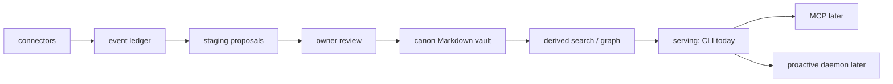

# Kizuki

気づき. Awareness; the moment of realization.

**Your life, queryable as a CLI.** Kizuki is a local-first personal memory
substrate. Connectors capture source-linked evidence into an append-only
ledger. Deterministic staging turns that evidence into proposals. The owner
reviews those proposals and promotes accepted ones into a canonical Markdown
vault on their own disk. The CLI queries that vault.

An MCP serving layer for client harnesses is designed
(see [docs/architecture.md](docs/architecture.md)) but not built. Kizuki is
not a harness and hosts no agents. A client harness brings its own loop and
connects here.

## How it works

```
connectors
  → event ledger
  → staging proposals
  → owner review
  → canon Markdown vault
  → derived (search / graph)
  → serving (CLI today; MCP later)
  → proactive daemon (later)
```



Capture never writes canon. Only an owner-invoked promote does. Search and
graph are disposable. They rebuild from the ledger plus canon.

## Packages

One Bun workspace. Four packages. There is no MCP package.

- **`@kizuki/core`** owns the durable contracts and policy boundary: event
  ingest, the append-only ledger, connection state, staging, owner promote,
  the Markdown vault, FTS search, graph, timeline, purge with receipts, and
  agent identity, grants, and audit.
- **`@kizuki/cli`** is a thin command-line composition over public core and
  connector APIs. Verbs on this branch: `init`, `connect`, `backfill`,
  `sync`, `import`, `review`, `promote`, `reject`, `query`, `doctor`,
  `purge`, `export`, `version`.
- **`@kizuki/connectors`** owns the connector interface, the in-tree
  registry, and the shared conformance suite. Registry today:
  `kizuki.markdown-folder`, `kizuki.import-chatgpt`, `kizuki.import-claude`.
  All three read local files. No sign-in or OAuth connector is built.
- **`@kizuki/tui`** is the owner review interface: pure state transitions and
  rendering, with terminal I/O at the edge. The CLI `review` verb opens it
  when stdin and stdout are a terminal.

## Data contracts

- **Ingest.** Connectors emit `kizuki.event/v1`. The spine accepts an event
  as stored, duplicate, or error. Dedupe is
  `(connector_id, source_record_id, content_hash)`. The spine assigns
  `event_id` and `content_hash`. Callers cannot supply them.
- **Promote.** Staging holds `kizuki.proposal/v1` records. Only
  `ownerPromote` writes canon. Agents and automation may propose. They
  cannot put a page.
- **Derived.** Search (SQLite FTS5) and graph edges rebuild from the ledger
  plus canon. `rebuildDerived` is the library call. The CLI indexes search
  after each ingest and promote; there is no CLI rebuild verb yet, and the
  graph is not indexed on the write path.
- **Fail closed.** A missing sensitivity label is not served. Missing
  connector credentials refuse. An unknown agent gets no access.
  Enforcement lives in core authorization and search. The CLI `query` verb
  searches through core with a `private` ceiling, so unlabeled pages and
  events are withheld and counted on stderr.

The frozen contracts and invariants are in
[docs/architecture.md](docs/architecture.md). Merged RFCs under `rfcs/`
bind only when their status says they do.

## Pledges

- **Free local forever.** The local product is MIT. Recall is never metered.
- **Zero phone-home.** No telemetry, no crash reports, no update checks. The
  only network calls are the owner's configured connectors and the owner's
  configured model endpoint. Today there are zero runtime dependencies and
  zero network calls anywhere in the tree. CI greps both the dependency
  manifests and the source for network surface.
- **Your files.** Canon is Markdown on the owner's disk. Deleting Kizuki
  leaves a readable vault.
- **Nothing writes canon but you.** Agents and automation can only propose.

## Try it (pre-alpha)

Pre-alpha. This README claims only what runs on this branch. Nothing is
packaged or installable. There is no compiled binary and no registry
release. Below, `kizuki` stands for `bun packages/cli/src/main.ts` run from
the tree.

Config lives at `$KIZUKI_CONFIG`, else `$XDG_CONFIG_HOME/kizuki/config.toml`,
else `$HOME/.config/kizuki/config.toml`. Only `default_vault` and named
`[vaults]` are read. Every verb accepts `--vault <path|name>`.

Wave 1 verbs:

- `init` — create a vault and set `default_vault` when none is configured
- `connect` — enroll a local-folder source as an opaque connection
- `backfill` — historical sweep for one selected connection
- `sync` — incremental sweep for one, some, or every active connection
- `import` — connect plus backfill in one step
- `review` — list staged proposals, or open the TUI on a terminal
- `promote` — owner-promote one pending proposal into canon
- `reject` — reject a pending proposal
- `query` — full-text search over labeled canon and ledger text
- `doctor` — report vault, connection, receipt, and hold health
- `purge` — physically delete matching events, with a receipt
- `export` — dump vault files and ledger tables to a directory
- `version` — print the CLI package version

Unlabeled capture is never served by `query`. Sign-in connectors are not
wired yet.

```
kizuki init ./vault
kizuki import markdown-folder --source ./notes
kizuki review --list
kizuki promote <id> --sensitivity personal
kizuki query acme
kizuki doctor
kizuki export --out ./export
```

Designed, not built (see [docs/architecture.md](docs/architecture.md)):

- MCP serving and a standing serve daemon
- Sign-in and OAuth connectors
- A compiled binary and an install path
- CLI verbs for rebuild, disconnect, timeline, entity, and graph

## Develop

Requires [Bun](https://bun.sh). CI pins 1.3.10. TypeScript is strict.

```
bun install --frozen-lockfile
bun run typecheck
bun test
bun run verify
```

`bun run verify` is the full gate: frozen install, typecheck, tests, and
the policy and network scanners.

The CLI is not installed. Run it from the tree:

```
bun packages/cli/src/main.ts version
```

## Security

Captured text, metadata, filenames, archives, and provider responses are
attacker-controlled input. Unlabeled pages and events are not served by the
authorization engine. Credentials stay behind `env:` and `file:` secret
references. They are never persisted as plaintext in SQLite, logs, fixtures,
or Markdown.

The threat model and the ten invariants live in
[docs/architecture.md](docs/architecture.md).

## License

[MIT](LICENSE).
