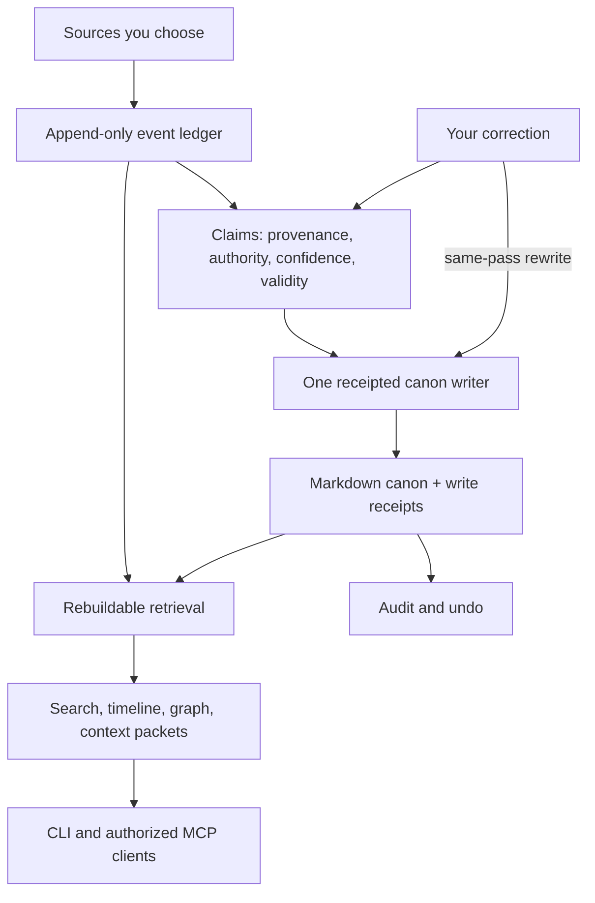

<div align="center">

# Kizuki

### Let nothing learned be lost.

**The memory layer for your AI life.**

Source-linked knowledge. Autonomous upkeep. Readable ownership.<br />
A local-first personal world model, shared with the agents you authorize.

[Quick start](#quick-start) · [Connect sources](#connect-sources) · [Architecture](#architecture) · [Bring your agents](#bring-your-agents) · [Status](#status)

[](LICENSE)
[](#status)
[](https://bun.sh)

</div>

---

The decision is in an old chat. The reasoning is in a note. The correction
happened three sessions ago. You start with a new agent and explain it all
again.

**Your context should outlive the tool that learned it.**

Kizuki brings the sources you choose into a private, source-linked memory.
Captured history becomes evidence; evidence supports claims; a receipted writer
turns those claims into durable Markdown. You can search the record, give an
authorized agent relevant context, correct a mistaken claim, and undo a write.
The knowledge stays on your disk.

The ambition is continuity: the decisions, relationships, corrections, and
standards behind your work remain available when the session ends or the tools
change. A fallible working understanding that you can inspect and improve.

> **Pre-alpha · v0.1.0.** The local capture-to-context loop is runnable from a
> checkout. Autonomous canon writing requires a usable model bound by the running host; capture,
> search, context, audit, and undo remain useful without one. This is not a
> 1.0 release or a published installer. [Current capabilities and limits →](#status)

## Begin with the context you already have

**Carry a project into the next session.** Import its notes or an exported AI
conversation. Search the evidence and compile a purpose-bounded context packet
for the next authorized agent. Kizuki supplies the memory; your client supplies
the conversation and its own reasoning.

**Keep a correction attached to what it corrects.** Use `tell --claim` to name
a live claim. The correction supersedes that claim and rewrites affected canon
in the same pass. The resulting receipt gives you an undo path.

**See the evidence behind the record.** Inspect sources, claim authority,
validity, and write receipts. Use search, timeline, and graph tools through MCP
to recover context without treating an inference as unquestionable fact.

## Quick start

Requires **Bun 1.3.10**, the version pinned by CI, and Git. Clone this repository
using GitHub's **Code** menu, then open a terminal at the repository root.
Nothing below installs Kizuki globally.

This demo uses synthetic notes in a new temporary directory. It leaves your
default vault unchanged and explicitly opts out of installing a user service.

```bash
bun install --frozen-lockfile

demo="$(mktemp -d)"
mkdir "$demo/notes"
cat > "$demo/notes/atlas.md" <<'NOTE'
# Project Atlas
Mira leads Project Atlas.
We chose keyboard-first navigation for the accessibility prototype.
NOTE

cat > "$demo/policy.json" <<'POLICY'
{"purposes":["capture","recall","session","derive"],"allowed_fields":["text","subjects","attachments","metadata"],"retention":"persistent_owned_until_revoked","egress":"local_only","sensitivity_floor":"private"}
POLICY
chmod 600 "$demo/policy.json"

bun packages/cli/src/main.ts init "$demo/vault" --no-default --no-service
bun packages/cli/src/main.ts import markdown-folder --source "$demo/notes" --policy "$demo/policy.json" --expected-revision 0 --operation-id demo-import --vault "$demo/vault"
bun packages/cli/src/main.ts query "Atlas" --vault "$demo/vault"
bun packages/cli/src/main.ts context --purpose session --query "Atlas" --vault "$demo/vault"
bun packages/cli/src/main.ts doctor --vault "$demo/vault"
```

**What to look for:** imported evidence, searchable text, a context packet, and
live claim IDs in `doctor`. Importing does **not** write canon. Without a model,
expect `canon writing: off`; the demo does not invent generated pages or model
answers. `doctor` also reports missing or degraded infrastructure and can exit
nonzero when the vault needs attention.

For a persistent vault, `init /absolute/path/to/vault` records it as the default
and installs the user service when a supported supervisor is present. The CLI
still works when the daemon is down. `--no-service` is an explicit opt-out,
not the normal always-on setup.

In the examples below, `kizuki` means the native executable or
`bun packages/cli/src/main.ts` from a checkout. Every verb accepts
`--vault <path|name>`. See the [CLI reference](docs/cli.md) for configuration,
flags, JSON output, and exit codes.

### Native local package

<details>
<summary><strong>Build a Linux x86_64 package with the runtime included</strong></summary>

The local release build bundles Kizuki, its dependencies, and Bun into
`kizuki` and `kizuki-mcp` for **Linux x86_64 baseline CPUs**.

```bash
bun run build:release
cd dist/kizuki-0.1.0/bun-linux-x64-baseline
sha256sum -c SHA256SUMS
./kizuki version
```

This is a locally built package. It is not registry-published, signed,
statically linked, or validated for other operating systems. There is no
supported `npm i -g kizuki` install. Install a user service only after placing
the executable in its final location; moving it requires reinstalling the
service.

[Artifact layout, checksums, and smoke tests →](docs/native-build.md)

</details>

## Connect sources

Start with `kizuki connect` to see the catalog and
`kizuki connect status` to inspect enrolled sources and their last run.
New enrollment requires an explicit [source consent policy](docs/cli.md#source-consent)
before capture. Import accepts `--policy FILE --expected-revision 0
--operation-id ID`; otherwise it prints the enrolled key and grant next step.
Revocation denies use immediately; physical purge may remain blocked and must be
reported as pending. Connections assign sensitivity automatically from their policy; you do not
need to label every captured record by hand.

| Your source | Available entry point | Boundary that matters |
| --- | --- | --- |
| Markdown notes | `import markdown-folder --source PATH` | Local folder ingestion. |
| AI conversation history | `import import-chatgpt` or `import import-claude`, with `--source PATH` | Export files, not live account sync. |
| WhatsApp, Pocket, Omnivore exports | `import import-whatsapp`, `import import-pocket`, `import import-omnivore`, with `--source PATH` | Reads the export you supply. |
| Messaging accounts linked in Beeper | `connect beeper --token-ref env:BEEPER_TOKEN` | Read-only local Desktop API; history depends on Beeper. |
| IMAP email | `connect imap` | Interactive terminal enrollment; read-only mailbox access. |
| Calendar files | `import ics --source PATH` | ICS file ingestion, not Google Calendar OAuth. |
| Screenpipe text and transcripts | `connect screenpipe --source PATH` | Offline database adapter. Screenpipe must be fully stopped. |
| An existing knowledge estate | `import import-legacy-wiki` or `import import-legacy-events`, with `--source PATH` | One-shot importers with owner-written mapping files; see [migration](docs/legacy-import.md). |

**Beeper.** Enable its Desktop API and create an approved connection token in
**Beeper Desktop → Settings → Integrations**. Supply that token through an
environment variable or an owner-only local file, then:

```bash
kizuki connect beeper --token-ref env:BEEPER_TOKEN
kizuki connect grant --source KEY --policy POLICY.json --expected-revision 0 --operation-id beeper-grant
kizuki backfill beeper
kizuki connect status
```

Keep Beeper running during capture. Kizuki reads the local history it exposes;
it does not send messages, mark them read, or tunnel them through a Kizuki
service. Missing messages are not assumed deleted. Connector coverage is
synthetic, not a claim of live-account validation.

**IMAP.** From an interactive terminal:

```bash
kizuki connect imap
kizuki connect grant --source KEY --policy POLICY.json --expected-revision 0 --operation-id imap-grant
kizuki backfill imap
```

The prompt collects server, port, username, app password, and folders. The
password is masked while typed and is not accepted as a command-line flag.
Kizuki keeps connection state in the owner-only local store. It does not send,
delete, move, or mark mail read.

**Source limits are part of the contract.** Native Telegram CLI sign-in is
wired, but requires project app credentials and has no real-account qualification receipt.
Native [Gmail](docs/gmail.md) and [Google Calendar](docs/google-calendar.md) browser enrollment
require operator desktop-client configuration and separate source consent; live-account
qualification remains pending. WHOOP and X account flows are not advertised as available here.
Screenpipe is neither a live screen recorder nor a media importer; its adapter
requires a compatible, stopped database and does not emit source-deletion
tombstones.

[Connection setup and history limits →](docs/connect.md) ·
[Screenpipe operating requirements →](packages/connector-screenpipe/README.md)

## Architecture

Kizuki separates what happened, what the system believes, and what it writes.
That separation makes correction, provenance, retrieval, and deletion
possible without giving every component unrestricted access to every other.



The autonomous loop needs a configured model to write canon. Explicit owner
correction remains available without one once a live claim exists. Advanced
retrieval depends on the selected ports; lexical search is the model-free
floor.

### Evidence remembers the source

Connectors emit the frozen `kizuki.event/v1` envelope. Source identity,
occurrence time, observation time, subjects, and content hashes travel into
an owned ledger. Repeated delivery can deduplicate; a changed source record
can arrive as new evidence. Source deletions are represented where the
connector supports them.

This is the foundation for asking where a claim came from and computing
which derived records depend on it.

### Claims remember that understanding can change

A claim carries its supporting event IDs and the context needed to interpret
it: authority, confidence, sensitivity, validity, and lifecycle state.
Correction is supersession of a named claim, rather than an unrelated note
left somewhere else.

The authority order is explicit:

```text
owner_correction > owner_authored > connector_evidence > model_inference
```

A model's interpretation cannot outrank your correction. Current and
superseded knowledge remain distinguishable, so a past belief need not be
presented as a current fact.

### Canon makes the memory readable

**Canon** is the durable Markdown record on your disk. The loop's writer
materializes claims into pages; capture itself never writes a page. Each
write records provenance, confidence, sensitivity, writer, model reference
when applicable, and before/after hashes.

Those receipts make a write inspectable and reversible. `audit` shows what
changed; `undo` restores prior canon bytes. The audit TUI presents the diff
first, with deeper hashes and provenance available when needed.

There is no owner approval queue. The owner's control is correction and undo,
with write budgets and health reporting around the autonomous loop.

### Retrieval gives the same memory several views

Lexical search works without a model. The optional embedded retrieval package
adds a hybrid recipe and entity-graph traversal behind a versioned port;
vector retrieval depends on available embeddings. The retrieval store is
derived state, separate from authoritative SQLite records and Markdown canon.

Context packets combine relevant knowledge into a purpose- and token-bounded
brief. The privacy checks apply before material is packed. A larger budget
never grants more access, and a packet is not an exhaustive export.

[Storage and contracts →](docs/architecture.md) ·
[Context privacy →](docs/context-privacy.md) ·
[Autonomous-canon design →](rfcs/0002-autonomous-canon.md)

<a id="how-to-use"></a>

## Use the memory, inspect the changes

```bash
# Recover evidence and prepare the next session.
kizuki query "Atlas"
kizuki context --purpose session --query "Atlas" --budget 2000

# Find a live claim ID, then correct that specific claim.
kizuki doctor
kizuki tell "Lea now leads Project Atlas" --claim LIVE_CLAIM_ID

# Inspect write receipts, then reverse a selected write.
kizuki audit --list
kizuki undo RECEIPT_ID
```

Replace `LIVE_CLAIM_ID` with a live ID from `doctor`, and `RECEIPT_ID` with a
write receipt from the correction or audit output. A missing target is not
silently guessed. `undo --cascade` is available for dependent writes; it does
not resurrect purged events.

<details>
<summary><strong>Public command map</strong></summary>

| Task | Commands |
| --- | --- |
| Create and inspect a vault | `init`, `doctor`, `version` |
| Bring evidence in | `connect`, `backfill`, `sync`, `import` |
| Retrieve context | `query`, `context` |
| Rebuild derived retrieval | `rebuild [--layer all]` |
| Correct and inspect canon | `tell`, `audit`, `undo` |
| Operate the local loop | `serve`, `serve status`, `serve run <rail>` |
| Import owner-supplied model weights | `models pull --from PATH` |
| Delete or leave | `purge`, `export`, `restore` |

`help <verb>` documents flags and exit codes. `models pull` copies a local
GGUF file; it does not download weights. `review`, `promote`, and `reject`
are retired. `timeline` is an MCP tool, not a CLI verb. `rebuild` reconstructs
the configured retrieval store and the SQLite floor; only `--layer all` is
supported. Its report identifies the backend and counts the actual documents
in that store, with a separate `floor_documents` count.

[Full CLI reference →](docs/cli.md)

</details>

## Bring your agents

Kizuki owns the memory. Your chosen client owns its agent loop.

The stdio MCP adapter exposes the same core policy boundary used by serving:
identity, grants, sensitivity ceilings, scope filters, tool allowlists, rate
limits, and audit. Permission is enforced below the prompt layer.

For an agent with an **already-provisioned identity and grant**, keep its
token in an environment variable and launch:

```bash
bun packages/mcp/src/bin.ts --vault /absolute/path/to/vault --token-env KIZUKI_AGENT_TOKEN
```

The local native package also provides `kizuki-mcp`. Tokens never belong in
command-line arguments. Agent provisioning is a core API capability on this
revision; there is no `kizuki agent add` command.

| Read tools | Write tools |
| --- | --- |
| `search`, `get_page`, `query_entities`, `timeline`, `context_packet`, `graph_neighbors`, `system_health` | `propose`, `correct` |

`propose` files a claim. `correct` relays an authorized correction. Neither
exposes unrestricted page writes; there is no `put_page` tool.

<details>
<summary><strong>Local owner-mode launch</strong></summary>

```bash
bun packages/mcp/src/bin.ts --vault /absolute/path/to/vault --owner
```

`--owner` gives the client owner authority. Use it only for a fully trusted
local client; it is not a least-privilege configuration for an arbitrary
agent. Sensitive or unlabelled evidence is still subject to the core's
applicable fail-closed checks.

</details>

The goal is a memory that survives a change of model or harness. Only clients
you authorize can consult it, and the context they receive remains bounded
by their grant. [Serving architecture →](docs/architecture.md#serving--agents-as-first-class-citizens)

<a id="contracts-that-bind"></a>

## Your data, your boundaries

**Local custody.** Authoritative state lives in SQLite under your vault's
`.kizuki/` directory; canon is ordinary Markdown. An optional retrieval engine
owns its rebuildable store under `.kizuki/retrieval/`. Reading your canon does
not require Kizuki to keep running.

**Zero phone-home.** Kizuki's runtime network access is limited to explicitly
configured connectors and model endpoints. There is no Kizuki telemetry or
required hosted memory service. Choosing a remote model can send selected
data to that endpoint; giving a client context also places it inside that
client's trust boundary. Local-first does not erase those choices.

**Fail-closed serving.** Missing labels, identity, grants, or required
provenance do not become permission. Captured text is untrusted data;
serving keeps quoted capture distinct from canon and carries trust metadata.

**A readable exit.** `export` writes a `kizuki.backup/v1` directory;
`restore` verifies hashes and completeness before restoring into an empty
target. `purge` removes selected data with a receipt, and `purge --verify`
reports per-store absence and operation state. Local purge is not a promise
to erase provider history, independent backups, or forensic traces on disk.

**An honest threat model.** The current vault and canon are not encrypted by
Kizuki. Someone who can read your files can read this data. Secret references
and owner-only connection-state files do not make a compromised host safe.
[Security model and private reporting →](SECURITY.md)

<a id="what-runs-on-this-revision"></a>

## Status

**Pre-alpha, version 0.1.0.** The distinction between a working capability and
the complete product matters.

| Layer | What this revision supports |
| --- | --- |
| Capture | Local folders and exports, offline Screenpipe ingestion, read-only Beeper Desktop access, and interactive IMAP enrollment. |
| Recall | Model-free lexical search, context packets, and MCP read tools. Advanced retrieval is conditional on ports and data. |
| Canon | A model-configured autonomous writer; live-claim correction, receipts, audit, and undo. |
| Operations | A local serve loop, loopback HTTP, user-service installation when a supervisor exists, and doctor reporting. |
| Packaging | Source execution and a locally built Linux x64 baseline native package. No published or signed installer. |
| Release proof | The automated artifact-isolation check is a prerequisite. Human stranger proof and the owner's estate cutover are still outstanding. |

<details>
<summary><strong>Models, the local loop, and current operating limits</strong></summary>

Model selection is recorded in `[ports.llm]` in
`<vault>/.kizuki/serve.toml`; daemon settings and canon-write budgets also
live there. `doctor` reports the configuration and whether canon writing is
on or off. A configured model is not evidence that an endpoint is healthy.
The model provider, credentials, hardware, and any provider charges are yours
to choose and supply.

Without a model, capture, ledgering, lexical search, context, audit, and undo
continue to work. Explicit correction of an existing live claim is also
model-free. The autonomous loop will not independently write canon.

The serve loop includes connector sync, retrieval and purge sweeps, embedding
backfill, a daily brief written through the file notifier into `dashboards/`,
doctor sweeps, and journal pruning. These jobs depend on their configured
inputs and ports. Telegram, email, and webhook delivery are not shipped
notifiers. Loopback HTTP is local, not a hosted multi-tenant API.

The [native artifact proof](docs/stranger-proof.md) checks release isolation.
It does not replace a human installing the product successfully, and does
not establish that the owner's previous system has been replaced.

</details>

### The larger horizon

The intended world model reaches beyond contacts and project notes: ideas,
commitments, skills, tools, decisions, and demonstrated taste. The higher
ambition is to preserve why a choice mattered, what changed afterward, and
which standards should guide the next piece of work.

Richer taste and skill compilation, research-driven enrichment, proactive
insights and scenarios, broader account connections, and consented shared
worlds remain **direction**, not a claim that this release delivers them.
A scenario must remain distinguishable from a fact; an inferred preference
must remain scoped and revisable.

The foundation is being built to make that ambition inspectable: evidence,
claims, correction, readable canon, permission-bounded retrieval, and a
real exit. [Product direction →](docs/product-context.md)

<a id="what-this-is-not"></a>

Kizuki does not host agents, replace a messaging client, or promise perfect
memory. It makes the context around a life queryable. The person remains
larger than the model.

## Build on Kizuki

The architecture is a modular monolith with versioned ports. Connectors,
models, embedding, retrieval, and other replaceable components have explicit
boundaries. Authoritative storage remains local SQLite plus Markdown;
optional engines do not get to redefine ownership.

To add a source, implement `kizuki.connector/v1`, emit `kizuki.event/v1`, and
pass the shared conformance suite. The contract covers manifests, health,
authentication, backfill, sync, revocation, source-purge capability, and
fixtures. Unsupported provider behavior must be declared rather than
imitated. New sources enter the same ledger and claim path.

<details>
<summary><strong>Repository map</strong></summary>

```text
packages/
├── core/                  # contracts, ledger, claims, canon, policy, serving
├── cli/                   # public commands and local loop composition
├── connectors/            # curated registry, importers, conformance tests
├── connector-telegram/    # native sign-in; project credentials required
├── connector-imap/        # read-only email and terminal enrollment
├── connector-ics/         # calendar-file ingestion
├── connector-screenpipe/  # offline screen text and transcription ingestion
├── mcp/                   # stdio adapter over core policy
├── llm/                   # no-model and compatible-endpoint providers
├── embed-gguf/            # owner-supplied local GGUF embedding
├── retrieval-pg/          # optional embedded retrieval and graph
└── tui/                   # audit and undo
```

</details>

From a full-history checkout:

```bash
bun run verify
```

The verifier runs the frozen install, typecheck, tests, workflow and policy
checks, network-surface checks, and tracked-content, history, and secret
scans. There is no benchmark claim hidden in a test count.

[Contributing](CONTRIBUTING.md) · [Agent instructions](AGENTS.md) ·
[Binding decisions](docs/decision-log.md)

## Documentation

| Read next | What you will find |
| --- | --- |
| [CLI reference](docs/cli.md) | Commands, flags, configuration, output, exit codes. |
| [Connect](docs/connect.md) | Beeper and IMAP setup, custody, sync behavior, limits. |
| [Architecture](docs/architecture.md) | Storage, trust boundaries, event and claim contracts. |
| [Context privacy](docs/context-privacy.md) | Scope, sensitivity, provenance, packing, and audit. |
| [Autonomous canon](rfcs/0002-autonomous-canon.md) | Binding design for the writer, correction, and reversibility. |
| [Current direction](docs/CURRENT.md) | Product invariants and release-proof boundaries. |
| [Migration](docs/legacy-import.md) | Bringing an existing wiki or event history into Kizuki. |
| [Native build](docs/native-build.md) | Local binaries, checksums, and smoke tests. |

## Retrieval credit

The hybrid retrieval recipe, including reciprocal rank fusion, layered
near-duplicate filtering, authority-weighted finalization, and the
entity-graph walk, is a permitted fork of
[GBrain](https://github.com/garrytan/gbrain) at public commit
`8c70f6255047a7647adb30b1d6333a48068d9fa5`, vendored under
`packages/retrieval-pg/vendor/`. It is not a registry dependency. Rerank and
local GGUF remain Kizuki's own work.

Kizuki also builds on Bun, TypeScript, SQLite/FTS5, and the Model Context
Protocol. [Upstream policy and attribution →](docs/upstream-policy.md)

## License

[MIT](LICENSE). **Free local forever. Recall is never metered.**

---

<div align="center">

**What you worked to learn should remain yours.**

[Start with one source.](#quick-start)

</div>

A [durable fixture observation harness](docs/qualification.md) can retain exact
artifact and automatic-rail evidence across explicit samples. It does not start
services or count synthetic tests as elapsed observation, estate qualification,
or human-use acceptance.
