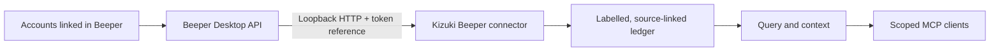

# Connect local sources

`kizuki connect` shows the source catalog. `kizuki connect --json` gives the
same catalog as a CLI envelope, and `kizuki connect status [--json]` reports
the enrolled sources, privacy defaults, last run, stored count, and errors.

File folders and exports remain local imports. The available catalog is the
truth for this revision; entries marked unavailable are not wired through the
CLI.

## Connection design

Public documentation checked on 2026-09-04: Sealgate's Connect setup uses
Beeper to reach linked messaging accounts. Its local `stdiod` companion
tunnels connector tools to a gateway for remote agents. Kizuki uses the same
documented messaging bridge through an independent, read-only connector.



The connection catalog, authenticated local enrollment, saved run status,
paginated capture, and agent recall are implemented here. Cloud tunneling,
message sending, and Sealgate's gateway policy engine are outside this
connector's scope. Messaging networks are supplied by the accounts already
linked in Beeper; Kizuki does not advertise a separate connector for each one.

## Beeper Desktop

Kizuki can read history exposed by the local Beeper Desktop API. First enable
the Desktop API and create an approved connection token in **Beeper Desktop →
Settings → Integrations**. Keep the token outside the repository and shell
history where possible.

```bash
export BEEPER_TOKEN='approved-token'
kizuki connect beeper --token-ref env:BEEPER_TOKEN --sensitivity private
kizuki backfill beeper
kizuki connect status
```

The default endpoint is `http://127.0.0.1:23373`. To use an explicitly chosen
local endpoint:

```bash
kizuki connect beeper \
  --token-ref file:/absolute/path/to/beeper-token \
  --endpoint http://127.0.0.1:23373 \
  --sensitivity private
```

The `env:` reference accepts an environment-variable name. The `file:`
reference must be absolute and name an owner-only regular local file. Kizuki
stores the reference, never the token value.

Keep Beeper running during capture. `backfill beeper` and `sync beeper`
walk the available message history in bounded pages, resuming an interrupted
walk from its saved cursor. A completed walk restarts from the newest page
next time; unchanged records deduplicate. This conservative polling also
finds edits and explicit deletion markers present in the local history.
Messages merely absent from a later response are never treated as deleted.
Pages contain at most 20 messages. Attachment references, filenames, MIME
types, and known byte sizes are retained; file contents and download URLs
are not captured.

This is read-only message ingestion. Kizuki does not send messages, mark them
read, launch an OAuth flow, or relay data through a Kizuki cloud service.
Beeper Desktop determines which linked accounts and how much local history are
available. This repository has synthetic coverage for the connector; it does
not claim a live Beeper account test.

The connector design follows the local-first connection model described by
[Sealgate Connect](https://sealgate.ai/connect.md) and uses Beeper's documented
[Desktop API](https://developers.beeper.com/desktop-api/index.md) and
[authentication model](https://developers.beeper.com/desktop-api/auth/index.md).

## IMAP email

IMAP enrollment is terminal-only because the mailbox password is never accepted
as a command-line flag. Run this from an interactive local terminal:

```bash
kizuki connect imap --sensitivity private
```

Kizuki asks for the server, port, username, app password, and folders. The app
password is hidden while typed. Standard input and output must be terminals, so
piped input and automation cannot supply credentials. Kizuki keeps the resulting
connector state in its owner-only connection-state store; it does not put mail
credentials in config, CLI output, or the ledger. Re-running the command
re-authenticates the existing IMAP source atomically, keeping its source key.
If more than one IMAP source exists, choose the source key shown by `kizuki
connect status`: `kizuki connect imap --source KEY`.

After enrollment, run `kizuki backfill imap`. The connector uses TLS and reads
mail without sending, deleting, moving, or marking messages read.
