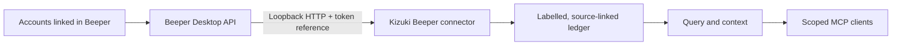

# Connect local sources

`kizuki connect` shows the source catalog. `kizuki connect --json` gives the
same catalog as a CLI envelope, and `kizuki connect status [--json]` reports
the enrolled sources, privacy defaults, last run, stored count, and errors.

File folders and exports remain local imports. `kizuki connect` lists every
registered source. A sign-in row can still need operator credentials; that is
not the same as the CLI refusing to enroll it.

New connections require an explicit owner [source consent policy](cli.md#source-consent)
before backfill or sync. Use the enrolled source key with `connect grant`;
credentials do not create a grant. Import can accept the policy before capture.

## CLI-enrollable sources

These connectors are wired through `kizuki connect` on this revision. Setup
and qualification limits follow; a missing live-account trial is not proof
that a provider application or account does not exist.

| Connector | How | Setup |
| --- | --- | --- |
| `kizuki.markdown-folder` | local folder | `connect markdown-folder --source PATH` |
| `kizuki.import-chatgpt` | export import | `connect import-chatgpt --source PATH` |
| `kizuki.import-claude` | export import | `connect import-claude --source PATH` |
| `kizuki.import-whatsapp` | export import | `connect import-whatsapp --source PATH` |
| `kizuki.import-pocket` | export import | `connect import-pocket --source PATH` |
| `kizuki.import-omnivore` | export import | `connect import-omnivore --source PATH` |
| `kizuki.import-x-archive` | export import | `connect import-x-archive --source PATH` |
| `kizuki.import-legacy-wiki` | estate import | [legacy import](legacy-import.md) |
| `kizuki.import-legacy-events` | estate import | [legacy import](legacy-import.md) |
| `kizuki.screenpipe` | offline SQLite | [Screenpipe](#screenpipe) |
| `kizuki.ics` | local ICS file | [ICS calendar file](#ics-calendar-file) |
| `kizuki.beeper` | local app token | [Beeper Desktop](#beeper-desktop) |
| `kizuki.imap` | interactive sign-in | [IMAP email](#imap-email) |
| `kizuki.telegram` | native sign-in | [Telegram](#telegram) |
| `kizuki.gmail` | browser sign-in | [Gmail](#gmail) |
| `kizuki.google-calendar` | browser sign-in | [Google Calendar](#google-calendar) |

WHOOP and the X API package are implemented as components and are **not** in
this list. See [not enrollable](#not-enrollable-from-this-cli).

## Connection design

Public documentation checked on 2026-09-04: Sealgate's Connect setup uses
Beeper to reach linked messaging accounts. Its local `stdiod` companion
tunnels connector tools to a gateway for remote agents. Kizuki uses the same
documented messaging bridge through an independent, read-only connector.



The connection catalog, authenticated local enrollment, saved run status,
paginated capture, and agent recall are implemented here. Cloud tunneling,
message sending, and Sealgate's gateway policy engine are outside this
connector's scope. Messaging networks are supplied by the accounts already
linked in Beeper; Kizuki does not advertise a separate connector for each one.

## Beeper Desktop

Kizuki can read history exposed by the local Beeper Desktop API. First enable
the Desktop API and create an approved connection token in **Beeper Desktop →
Settings → Integrations**. Keep the token outside the repository and shell
history where possible.

```bash
export BEEPER_TOKEN='approved-token'
kizuki connect beeper --token-ref env:BEEPER_TOKEN --sensitivity private
kizuki connect grant --source KEY --policy POLICY.json --expected-revision 0 --operation-id beeper-grant
kizuki backfill beeper
kizuki connect status
```

The default endpoint is `http://127.0.0.1:23373`. To use an explicitly chosen
local endpoint:

```bash
kizuki connect beeper \
  --token-ref file:/absolute/path/to/beeper-token \
  --endpoint http://127.0.0.1:23373 \
  --sensitivity private
```

The `env:` reference accepts an environment-variable name. The `file:`
reference must be absolute and name an owner-only regular local file. Kizuki
stores the reference, never the token value.

Keep Beeper running during capture. `backfill beeper` and `sync beeper`
walk the available message history in bounded pages, resuming an interrupted
walk from its saved cursor. A completed walk restarts from the newest page
next time; unchanged records deduplicate. This conservative polling also
finds edits and explicit deletion markers present in the local history.
Messages merely absent from a later response are never treated as deleted.
Pages contain at most 20 messages. Attachment references, filenames, MIME
types, and known byte sizes are retained; file contents and download URLs
are not captured.

This is read-only message ingestion. Kizuki does not send messages, mark them
read, launch an OAuth flow, or relay data through a Kizuki cloud service.
Beeper Desktop determines which linked accounts and how much local history are
available. This repository has synthetic coverage for the connector; it does
not claim a live Beeper account test.

The connector design follows the local-first connection model described by
[Sealgate Connect](https://sealgate.ai/connect.md) and uses Beeper's documented
[Desktop API](https://developers.beeper.com/desktop-api/index.md) and
[authentication model](https://developers.beeper.com/desktop-api/auth/index.md).

## IMAP email

IMAP enrollment is terminal-only because the mailbox password is never accepted
as a command-line flag. Run this from an interactive local terminal:

```bash
kizuki connect imap --sensitivity private
```

Kizuki asks for the server, port, username, app password, and folders. The app
password is hidden while typed. Standard input and output must be terminals, so
piped input and automation cannot supply credentials. Kizuki keeps the resulting
connector state in its owner-only connection-state store; it does not put mail
credentials in config, CLI output, or the ledger. Re-running the command
re-authenticates the existing IMAP source atomically, keeping its source key.
If more than one IMAP source exists, choose the source key shown by `kizuki
connect status`: `kizuki connect imap --source KEY`.

After enrollment, grant the intended policy with `kizuki connect grant --source KEY
--policy POLICY.json --expected-revision 0 --operation-id imap-grant`, then run
`kizuki backfill imap`. The connector uses TLS and reads
mail without sending, deleting, moving, or marking messages read.

Background sync, backfill and doctor check source capture permission before
opening provider transport. An explicit enrollment or reconnect can validate
the selected account before a capture grant exists; it does not grant access
to ingest history. Revocation blocks subsequent background opens immediately.
Already in-flight provider work remains bounded by its operation deadline;
capture checks permission again before storing results.

## Telegram

Native Telegram user sign-in is CLI-wired:

```bash
kizuki connect telegram --sensitivity private
```

An interactive terminal is required. The connector asks for an international
phone number, the login code Telegram delivers, and a two-step password when
the account has one. Enrollment writes protected session state under the vault
and captures no history. After an explicit source grant, run
`kizuki backfill telegram --source KEY`.

Project app credentials (`KIZUKI_TELEGRAM_API_ID` and
`KIZUKI_TELEGRAM_API_HASH`) are required. Missing credentials refuse before
any prompt or network connection. From a source checkout, export those
variables. The current native release build (`scripts/build-release.ts`)
compiles with `KIZUKI_COMPILED` only and does not inline Telegram app
credentials; a binary that includes them is a separate build. See
[the Telegram connector README](../packages/connector-telegram/README.md).

Re-sign-in preserves account identity, source key, and checkpoint. A different
account cannot inherit this source's history. Kizuki does not send messages or
delete Telegram copies. Deletion detection and remote message deletion are
unsupported. Secret chats are unread. Synthetic native CLI tests do not
qualify a live Telegram account.

Live-account qualification is unrun. Remaining blockers are project
`api_id`/`api_hash` registration and custody, a native build that actually
inlines those credentials, an authorized live account trial, and an
owner/legal disposition of Telegram API Terms restrictions on using Telegram
data for AI and ML. Login-code delivery for a given account is unknown until
that trial. This page does not claim that third-party sign-in is universally
prohibited, or that a Telegram application is absent.

## Gmail

Read-only Gmail browser sign-in is CLI-wired. Operator desktop-app
configuration (`KIZUKI_GMAIL_CLIENT_ID`, optional
`KIZUKI_GMAIL_CLIENT_SECRET_REF`) is required; missing configuration refuses
before browser or provider calls. This tree does not register a Google
application. Account qualification is unrun.

```bash
kizuki connect gmail --fields text,subjects,headers,labels,attachments
```

See [the Gmail native enrollment contract](gmail.md) for fields, consent,
reauthorization, and limits.

## Google Calendar

Read-only Google Calendar browser sign-in is CLI-wired. Operator desktop-app
configuration (`KIZUKI_GOOGLE_CALENDAR_CLIENT_ID`, optional
`KIZUKI_GOOGLE_CALENDAR_CLIENT_SECRET_REF`) is required. Choose one canonical
calendar id and explicit fields; literal `primary` is refused. Account and
artifact qualification remain separate and unrun.

```bash
kizuki connect google-calendar --calendar CANONICAL_ID --fields summary,description,location,attendees,attachments
```

See [the native Calendar contract](google-calendar.md) for fields, consent,
reauthorization, and limits.

## ICS calendar file

CLI enrollment is the none-mode file path:

```bash
kizuki connect ics --source /path/to/calendar.ics
```

Interactive HTTPS/webcal URL sign-in exists as a library surface and is not a
`connect` verb on this revision.

## Screenpipe

Offline read of a stopped screenpipe SQLite database. Quit screenpipe before
every connector operation, including health checks.

```bash
kizuki connect screenpipe --source ~/.screenpipe/db.sqlite
```

This is not live HTTP and needs no token. See the
[Screenpipe connector README](../packages/connector-screenpipe/README.md) for
schema bounds and limits.

## File exports and estate importers

ChatGPT, Claude, WhatsApp, Pocket, Omnivore, and X archive exports enroll with
`kizuki connect <connector> --source PATH`, or with `kizuki import` plus an
explicit policy. Estate wiki and event importers need owner-written mapping
files; see [legacy import](legacy-import.md). Snapshot importers do not infer
deletion from a shorter later export.

## Not enrollable from this CLI

- **WHOOP.** `@kizuki/connector-whoop` is a synthetic-tested provider
  component. It is not registered in the CLI. Native enrollment, live-account
  qualification, and provider OAuth compatibility are unrun. WHOOP documents a
  Client Secret as server-side only; local desktop custody of that secret is
  not sanctioned here. Public docs that mention an eight-character OAuth state
  or omit PKCE do not prove that WHOOP rejects Core's flow. See
  [WHOOP](whoop.md).
- **X API.** The owned-post API lives at `@kizuki/connector-x/api` and is not
  registered in the native CLI. The enrollable surface is the local archive
  importer `kizuki.import-x-archive`. See
  [the X API package notes](../packages/connector-x/API.md).
- Composio and WhatsApp Business API remain explicitly deferred.
