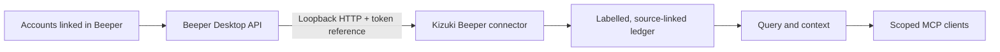

# Connect local sources

`kizuki connect` shows the source catalog. `kizuki connect --json` gives the
same catalog as a CLI envelope, and `kizuki connect status [--json]` reports
the enrolled sources, privacy defaults, last run, stored count, and errors.

File folders and exports remain local imports. `kizuki connect` lists every
registered source. A sign-in row can still need operator credentials; that is
not the same as the CLI refusing to enroll it.

New connections require an explicit owner [source consent policy](cli.md#source-consent)
before backfill or sync. Use the enrolled source key with `connect grant`;
credentials do not create a grant. Import can accept the policy before capture.

## CLI-enrollable sources

These connectors are wired through `kizuki connect` on this revision. Setup
and qualification limits follow; a missing live-account trial is not proof
that a provider application or account does not exist.

| Connector | How | Setup |
| --- | --- | --- |
| `kizuki.markdown-folder` | local folder | `connect markdown-folder --source PATH` |
| `kizuki.import-chatgpt` | export import | `connect import-chatgpt --source PATH` |
| `kizuki.import-claude` | export import | `connect import-claude --source PATH` |
| `kizuki.import-whatsapp` | export import | `connect import-whatsapp --source PATH` |
| `kizuki.import-pocket` | export import | `connect import-pocket --source PATH` |
| `kizuki.import-omnivore` | export import | `connect import-omnivore --source PATH` |
| `kizuki.import-x-archive` | export import | `connect import-x-archive --source PATH` |
| `kizuki.import-beacon` | agent-run snapshot | [Beacon import](beacon-import.md) |
| `kizuki.import-legacy-wiki` | estate import | [legacy import](legacy-import.md) |
| `kizuki.import-legacy-events` | estate import | [legacy import](legacy-import.md) |
| `kizuki.screenpipe` | offline SQLite | [Screenpipe](#screenpipe) |
| `kizuki.claude-code-sessions` | local transcript folder | [Coding-session transcripts](#coding-session-transcripts) |
| `kizuki.codex-sessions` | local transcript folder | [Coding-session transcripts](#coding-session-transcripts) |
| `kizuki.ics` | local ICS file or https feed | [ICS calendar](#ics-calendar) |
| `kizuki.beeper` | local app token | [Beeper Desktop](#beeper-desktop) |
| `kizuki.imap` | native account sign-in (terminal prompts) | [IMAP email](#imap-email) |
| `kizuki.telegram` | native sign-in | [Telegram](#telegram) |
| `kizuki.gmail` | native account sign-in (browser) | [Gmail](#gmail) |
| `kizuki.google-calendar` | native account sign-in (browser) | [Google Calendar](#google-calendar) |
| `kizuki.x` | native account sign-in (browser) | [X own-post API](#x-own-post-api) |

WHOOP remains a component without CLI enrollment. See
[not enrollable](#not-enrollable-from-this-cli).

## What a message connector contributes

Chat, coding-session and email connectors (Telegram, WhatsApp, Beeper, IMAP,
Gmail, the ChatGPT and Claude exports, and the coding-session transcripts)
emit `message` or `email` events. Their text is evidence, and it stays in the
ledger. Kizuki files no capture-note claim for a message, so a busy chat can
never grow one canon page per connector and day.

Without a model, once a source grant permits capture and recall:

- search finds the text;
- the timeline lists the messages in order;
- context packets quote relevant messages as `quoted capture` lines, tainted
  data and not instructions;
- doctor, audit and undo work as for any other source.

With a configured model and a source grant that includes `extract` for that
model's destination, the sync rail also runs typed extraction over the same
events. It admits source-anchored claims about concepts and situations, and
the receipted writer turns them into canon pages. Each claim cites the message
it came from. A message that yields no claim writes no page.

The entity stubs for speakers and chats that a message names (for example a
session role or a project id) are still proposed without a model. Markdown,
wiki and other page-kind sources are unchanged: their pages and verbatim
capture notes are still filed with no model.

Earlier revisions filed one capture note per message. The doctor sweep closes
those out as `skipped` with reason `message_capture_fanout`; see
[doctor](cli.md#doctor). Nothing is deleted, and the messages themselves stay in
the ledger.

## Connection design

Public documentation checked on 2026-09-04: Sealgate's Connect setup uses
Beeper to reach linked messaging accounts. Its local `stdiod` companion
tunnels connector tools to a gateway for remote agents. Kizuki uses the same
documented messaging bridge through an independent, read-only connector.


```mermaid
flowchart LR
  Accounts["Accounts linked in Beeper"] --> Desktop["Beeper Desktop API"]
  Desktop -->|"Loopback HTTP + token reference"| Connector["Kizuki Beeper connector"]
  Connector --> Ledger["Labelled, source-linked ledger"]
  Ledger --> Recall["Query and context"]
  Recall --> Agents["Scoped MCP clients"]
```

The connection catalog, authenticated local enrollment, saved run status,
paginated capture, and agent recall are implemented here. Cloud tunneling,
message sending, and Sealgate's gateway policy engine are outside this
connector's scope. Messaging networks are supplied by the accounts already
linked in Beeper; Kizuki does not advertise a separate connector for each one.

## Beeper Desktop

Kizuki can read history exposed by the local Beeper Desktop API. First enable
the Desktop API and create an approved connection token in **Beeper Desktop →
Settings → Integrations**. Keep the token outside the repository and shell
history where possible.

```bash
export BEEPER_TOKEN='approved-token'
kizuki connect beeper --token-ref env:BEEPER_TOKEN --sensitivity private
kizuki connect grant --source KEY --policy POLICY.json --expected-revision 0 --operation-id beeper-grant
kizuki backfill beeper
kizuki connect status
```

The default endpoint is `http://127.0.0.1:23373`. To use an explicitly chosen
local endpoint:

```bash
kizuki connect beeper \
  --token-ref file:/absolute/path/to/beeper-token \
  --endpoint http://127.0.0.1:23373 \
  --sensitivity private
```

The `env:` reference accepts an environment-variable name. The `file:`
reference must be absolute and name an owner-only regular local file. Kizuki
stores the reference, never the token value.

Keep Beeper running during capture. `backfill beeper` walks the available
message history backward in bounded pages, resuming an interrupted walk from
its saved cursor, and remembers the newest point the walk started from. `sync
beeper` then polls forward from that point and stops once nothing newer is
left, so a scheduled sync costs one page when the account is quiet. A sync
that finds no remembered point reads one newest page to establish it, and a
sync handed an unfinished walk finishes that walk first. Running `backfill
beeper` again after a completed walk starts over from the newest page;
unchanged records deduplicate. This conservative polling also finds edits and
explicit deletion markers present in the local history. Messages merely absent
from a later response are never treated as deleted.
Pages contain at most 20 messages. Attachment references, filenames, MIME
types, and known byte sizes are retained; file contents and download URLs
are not captured.

This is read-only message ingestion. Kizuki does not send messages, mark them
read, launch an OAuth flow, or relay data through a Kizuki cloud service.
Beeper Desktop determines which linked accounts and how much local history are
available. This repository has synthetic coverage for the connector; it does
not claim a live Beeper account test.

The connector design follows the local-first connection model described by
[Sealgate Connect](https://sealgate.ai/connect.md) and uses Beeper's documented
[Desktop API](https://developers.beeper.com/desktop-api/index.md) and
[authentication model](https://developers.beeper.com/desktop-api/auth/index.md).

## IMAP email

IMAP enrollment is terminal-only because the mailbox password is never accepted
as a command-line flag. Run this from an interactive local terminal:

```bash
kizuki connect imap --sensitivity private
```

Kizuki asks for the server, port, username, app password, and folders, then
for an optional date floor. The app password is hidden while typed. Standard input and output must be terminals, so
piped input and automation cannot supply credentials. Kizuki keeps the resulting
connector state in its owner-only connection-state store; it does not put mail
credentials in config, CLI output, or the ledger. Re-running the command
re-authenticates the existing IMAP source atomically, keeping its source key.
If more than one IMAP source exists, choose the source key shown by `kizuki
connect status`: `kizuki connect imap --source KEY`.

After enrollment, grant the intended policy with `kizuki connect grant --source KEY
--policy POLICY.json --expected-revision 0 --operation-id imap-grant`, then run
`kizuki backfill imap`. The connector uses TLS and reads
mail without sending, deleting, moving, or marking messages read.

The date floor (`Only mail since (YYYY-MM-DD) [all]:`) is empty by default,
which reads each folder from its oldest message. With a date, mail whose
INTERNALDATE (the time the server received it, read at midnight UTC) is earlier
is never fetched and never remembered: it is not captured, and a later sync
does not treat it as deleted. The floor applies to messages not yet walked; it
does not remove anything already captured, and a source that already
backfilled keeps what it has. Re-running `kizuki connect imap` sets it again.

A mailbox is walked in pages of 200 messages. The list of UIDs already read is
kept in the ledger beside the checkpoint rather than inside it, so a mailbox
with many gaps (deleted or archived mail leaves holes in the UID sequence)
still checkpoints. That list is capped at 1 MiB per source across all
folders, which holds on the order of 400,000 messages at 30 percent gaps; past
that a batch is refused with `cursor_store would exceed 1048576 bytes`, and a
date floor is the way to bring a larger mailbox under it. `kizuki doctor` shows
the refusal as the source's last error.

Background sync, backfill and doctor check source capture permission before
opening provider transport. An explicit enrollment or reconnect can validate
the selected account before a capture grant exists; it does not grant access
to ingest history. Revocation blocks subsequent background opens immediately.
Already in-flight provider work remains bounded by its operation deadline;
capture checks permission again before storing results.

## Telegram

Native Telegram user sign-in is CLI-wired:

```bash
kizuki connect telegram --sensitivity private
```

An interactive terminal is required. The connector asks for an international
phone number, the login code Telegram delivers, and a two-step password when
the account has one. Enrollment writes protected session state under the vault
and captures no history. After an explicit source grant, run
`kizuki backfill telegram --source KEY`.

After `connect grant`, the first backfill reads every dialog back to its
beginning: there is no date floor, batches hold at most 500 events, and at most
5,000 dialogs are listed, after which health reports a truncated view. Each
later pass re-reads the last 200 messages of a dialog to catch edits; older
edits, deletions and secret chats are not captured. Where each dialog has got
to is kept in the ledger beside the checkpoint, not inside it, so an account of
any listed size checkpoints. A batch stops between dialogs after about 40
seconds, well inside the 60 second limit on one call, and the next batch
resumes there; a slow account therefore takes more batches, not a timeout.

Project app credentials (`KIZUKI_TELEGRAM_API_ID` and
`KIZUKI_TELEGRAM_API_HASH`) are required. Missing credentials refuse before
any prompt or network connection. From a source checkout, export those
variables. The native release build (`scripts/build-release.ts`) inlines that
pair when both are set in its environment and records their names, never their
values, in the package's `BUILD.json`; a package built with neither set records
`compiled_credentials: []` and still reads the two variables from its own
environment at run time. See
[the Telegram connector README](../packages/connector-telegram/README.md).

Re-sign-in preserves account identity, source key, and checkpoint. A different
account cannot inherit this source's history. Kizuki does not send messages or
delete Telegram copies. Deletion detection and remote message deletion are
unsupported. Secret chats are unread. Synthetic native CLI tests do not
qualify a live Telegram account.

The 1.0.0 release package inlines the project pair, so sign-in needs no
environment variables there. Connect, the first state probe, `getMe` and
sign-out each have a 45-second deadline; a network that never opens fails in
seconds. Live-account qualification is unrun: no full sign-in, backfill and
sync on a real account is recorded for this revision, and the owner/legal
disposition of Telegram API Terms restrictions on using Telegram data for AI
and ML is still open. Login-code delivery for a given account is unknown until
such a trial. This page does not claim that third-party sign-in is universally
prohibited, or that a Telegram application is absent.

## Gmail

Read-only Gmail browser sign-in is CLI-wired. Operator desktop-app
configuration (`KIZUKI_GMAIL_CLIENT_ID`, optional
`KIZUKI_GMAIL_CLIENT_SECRET_REF`) is required; missing configuration refuses
before browser or provider calls. This tree does not register a Google
application. Account qualification is unrun. Gmail consent never enrolls
Calendar and Calendar consent never enrolls Gmail: the two connectors request
different scopes, keep provider-bound opaque state that the other refuses to
load, and declare different egress hosts.

```bash
kizuki connect gmail --fields text,subjects,headers,labels,attachments
```

See [the Gmail native enrollment contract](gmail.md) for fields, consent,
reauthorization, and limits.

## Google Calendar

Read-only Google Calendar browser sign-in is CLI-wired. Operator desktop-app
configuration (`KIZUKI_GOOGLE_CALENDAR_CLIENT_ID`, optional
`KIZUKI_GOOGLE_CALENDAR_CLIENT_SECRET_REF`) is required. Choose one canonical
calendar id and explicit fields; literal `primary` is refused. Account and
artifact qualification remain separate and unrun.

```bash
kizuki connect google-calendar --calendar CANONICAL_ID --fields summary,description,location,attendees,attachments
```

See [the native Calendar contract](google-calendar.md) for fields, consent,
reauthorization, and limits.

## X own-post API

Read-only own-post browser sign-in is CLI-wired. Use an interactive
terminal (add `--no-browser` on a headless server) with public `KIZUKI_X_CLIENT_ID` and `KIZUKI_X_REDIRECT_URI`
configuration. Register the callback exactly as
`http://127.0.0.1:PORT/callback`, with a port from 1 through 65535 that is free
on the machine that runs the CLI. On a headless server the browser's machine
reaches that port through the printed `ssh -L` tunnel, so the same port must
also be free there. Core uses S256 PKCE; enrollment needs no client secret or
pasted access token.

```bash
kizuki connect x-api --fields none --history-start 2026-01-01T00:00:00Z
```

`--fields none` still captures post text, author identity as a `from` subject,
and baseline metadata. It does not omit author subjects. Additional selections
are `relationships`, `links` and `media`; media captures attachment references.
Compatible source grants always require `text`, `subjects`, and `metadata`;
selecting `media` additionally requires `attachments`. A narrower policy is
refused; grants are not widened automatically. Enrollment captures no history.
Grant the new source's policy before running `kizuki backfill x-api --source KEY`.

The protected v2 state saves the public app configuration for background
capture, so later processes need no terminal exports. Existing sources retain
their account, app, selection and history during reauthorization. See the
[X enrollment reference](cli.md#x-own-post-api-enrollment) for bounded history,
legacy-state configuration and `connect recover-x-api` after an uncertain
refresh outcome.

An eligible X Native App and API usage credits are external prerequisites.
Live-account access and credit availability have not been qualified. The local
X archive importer remains available separately and requires no API access.

## ICS calendar

Two enrollment modes. The none-mode file path:

```bash
kizuki connect ics --source /path/to/calendar.ics
```

An https feed, such as a private calendar address from a calendar provider:

```bash
kizuki connect ics --url https://calendar.example.com/private/feed.ics
```

Only `https://` addresses are accepted (`webcal://` is rewritten to `https://`);
`http://` is refused before any request. The feed is fetched in full to prove
it parses when you enroll and each time a sync or `doctor` pass loads the
source, and the sync itself then re-reads it with ETag and Last-Modified
validation, so an unchanged feed costs one full read plus one conditional
request per pass. A private feed address embeds its own capability token, so
Kizuki keeps it only in owner-only connection state and never prints it or
stores it in the ledger database. Typed as `--url https://...` it appears in
your shell history and process list. To avoid that, pass `--url env:VAR` and
export the address in `VAR` first; Kizuki reads it from that variable. A vault
holds at most about 31 calendar sources of this kind; enrolling past that limit
fails with an identity-scan error. Each address is its own source, separate from any file calendar
you enrolled with `--source`, and the same address is not enrolled twice.
Enrollment captures nothing: grant the printed source key an explicit
[source consent policy](cli.md#source-consent), then run
`kizuki backfill ics --source KEY`.

## Sign-in on a headless server

Gmail, Google Calendar and X sign-in use a loopback callback, and the CLI
normally asks the system to open the authorization page. On a server with no
desktop, that opener is missing or fails. Kizuki then prints the authorization
address to stderr, together with the tunnel that carries the callback home,
and keeps waiting:

```text
No browser could be opened on this machine.
Open this address in a browser on any device and finish signing in there:
https://accounts.google.com/o/oauth2/v2/auth?...
The provider sends the browser back to 127.0.0.1:PORT on this machine. From the device with the browser, forward that port first:
  ssh -L PORT:127.0.0.1:PORT <host>
Still waiting for the sign-in to complete. Press Ctrl-C to cancel.
```

Run the printed `ssh -L` command on the device that has the browser, replacing
`<host>` with the login you use for this server, keep it open, then open the
printed address there. After you approve access the browser lands on
`127.0.0.1:PORT`, the tunnel carries it to Kizuki, and the command finishes. If
nothing arrives before the sign-in deadline the command fails cleanly, releases
its port and leaves any existing source untouched.

Pass `--no-browser` to skip the opener and print the address straight away, for
example when a desktop session exists but you want a different browser. Use it
too when the opener reports success but nothing appears, such as `xdg-open`
falling back to a text browser: if no window opens and no address is printed,
re-run with `--no-browser`. The
flag applies to `connect gmail`, `connect google-calendar`, `connect x-api` and
`connect recover-x-api`. A terminal is still required (`ssh -t`). The
operator's OAuth client configuration for each provider is unchanged.

## Screenpipe

Offline read of a stopped screenpipe SQLite database. Quit screenpipe before
every connector operation, including health checks.

```bash
kizuki connect screenpipe --source ~/.screenpipe/db.sqlite
```

This is not live HTTP and needs no token. See the
[Screenpipe connector README](../packages/connector-screenpipe/README.md) for
schema bounds and limits.

## Coding-session transcripts

Two connectors read the transcripts a coding agent writes to disk, so the
decisions and changes of direction made in a session reach the ledger. They
share one parser and differ only in the file format they expect:

| Connector | Folder to point at | Format |
| --- | --- | --- |
| `kizuki.claude-code-sessions` | the Claude Code projects folder | one JSONL file per session |
| `kizuki.codex-sessions` | the Codex sessions folder | one rollout JSONL file per session |

```bash
kizuki connect claude-code-sessions --source /absolute/path/to/projects
kizuki connect grant --source KEY --policy POLICY.json --expected-revision 0 --operation-id sessions-grant
kizuki backfill claude-code-sessions
kizuki sync claude-code-sessions
```

The source is a directory, read offline: nothing is fetched, no account or
token is involved, and the connector never writes to it. Enrollment refuses a
path that is not a readable directory. Until a source grant exists, capture is
refused (`source_capture_denied`). This policy authorizes local capture and
recall of the captured text and its provenance, with no model call:

```json
{
  "purposes": ["capture", "recall", "session", "derive"],
  "allowed_fields": ["text", "subjects", "metadata"],
  "retention": "persistent_owned_until_revoked",
  "egress": "local_only",
  "sensitivity_floor": "private"
}
```

Adding `extract` to `purposes` is a separate decision that names the exact
model destination; see [source consent](cli.md#source-consent). Without it,
sessions are searchable and servable but produce no concepts or situations.
The daemon's sync rail refreshes an enrolled source on its period.

### What is captured

Each user prompt and each assistant message with text becomes one `message`
event, labeled `private` unless the source policy says otherwise. Its
`source_record_id` is the session id plus the record's own id (for Codex, plus
the line number). Its subjects are the speaker role and a project id derived
from a hash of the working directory, with the directory's base name for
display. Its metadata carries the session id, branch, entrypoint, source file
and line, the names (never the inputs) of the tools used in that turn, and a
count of anything redacted.

- Only text is captured. Thinking, tool inputs and tool results are dropped,
  because that is where file contents, environment dumps and web pages land.
  There is no switch to include them.
- Subagent folders and sidechain records are skipped. The library option
  `include_subagents` reads them.
- Text is cut at 32 KiB (`text_truncated` in metadata).
- Terminal escapes, control characters, bidirectional controls, zero-width
  characters and invisible tag characters are removed before capture
  (`text_sanitized` in metadata). A turn that is empty after that is skipped.
- Embedded system reminders, task notifications, command wrappers and hook
  output blocks (including injected Kizuki context) are dropped, while
  surrounding owner words survive, in both Claude Code and Codex transcripts.
  An unfinished scaffold block drops its
  remainder. Ordinary XML content remains evidence.
- Secret-shaped strings are replaced by `[redacted:KIND]` before capture,
  because the ledger is append-only: private keys, API and access tokens, JWTs,
  `Authorization` headers, URL credentials, and `NAME=value` assignments for
  names that say secret, token, password, key or credential, including JSON and
  YAML fields. Core supplies the same patterns as agent serving, including
  Kizuki tokens, wrapped keys and percent-encoded credentials. The scrubber is a
  set of patterns, not a guarantee; treat the source as private.
- Transcript text is evidence, never instruction. A prompt that tells an agent
  to ignore its rules arrives as ordinary quoted text.
- Kizuki does not capture itself. A turn containing a Kizuki context packet is
  skipped, Kizuki's own MCP tools are never named, and sessions whose working
  directory is inside the vault are skipped. The host adds the vault at run
  time and does not store its path in the connection. The library option
  `exclude_cwd` lists further directories to skip.
- Metadata `source_file` is the transcript file name only, so the encoded
  working directory in a Claude Code folder name is not recorded.

### How a pass works

The cursor holds one watermark and a position, not a per-file map, so it stays
inside the cursor bound however many files exist. A pass reads only files
modified since the watermark, less a two-minute overlap, in modification-time
order, and a large pass resumes mid-file from the last line it consumed. A
file that changed is read again from its first line and the ledger
deduplicates what it already has. `backfill` and `sync` are the same walk.

### Limits

- The connector emits no tombstones. A transcript that disappears, for example
  through the harness's retention, is not a deletion, and a rewritten or
  truncated file never retracts what was captured. `kizuki purge --connector
  ID` physically removes captured evidence.
- A file that grows is captured up to its last complete line; an unterminated
  final line is read on the pass after it is finished.
- Links, pipes, directories deeper than four levels and over-long names are
  never read. `kizuki doctor` reports the connection as degraded with the
  counts. Files over 512 MiB and lines over 4 MiB are skipped too, and so are
  records the parser does not recognize (for example Codex record types other
  than session metadata and messages); those are counted per run and visible
  to library callers in `health().detail`, and are not persisted.
- A file copied in with an old modification time is not noticed until it
  changes. A resumed session that copies earlier records into a new file
  is captured again, with the new file recorded as their source.
- Only the current Codex rollout format, with a session record first and each
  message wrapped in a response item, is read.

## File exports and estate importers

ChatGPT, Claude, WhatsApp, Pocket, Omnivore, and X archive exports enroll with
`kizuki connect <connector> --source PATH`, or with `kizuki import` plus an
explicit policy. Estate wiki and event importers need owner-written mapping
files; see [legacy import](legacy-import.md). Snapshot importers do not infer
deletion from a shorter later export.

## Not enrollable from this CLI

- **WHOOP.** `@kizuki/connector-whoop` is a synthetic-tested provider
  component. It is not registered in the CLI, and `kizuki connect` prints it in
  this section rather than leaving it out of the catalog. Native enrollment,
  live-account qualification, and provider OAuth compatibility are unrun:
  WHOOP's documented eight-character OAuth state and registered redirect are
  unqualified against Core's PKCE and dynamic loopback callback, and local
  desktop custody of the server-side Client Secret WHOOP documents is not
  sanctioned here. Public docs that mention an eight-character OAuth state or
  omit PKCE do not prove that WHOOP rejects Core's flow. See
  [WHOOP](whoop.md).
- Composio and WhatsApp Business API remain explicitly deferred.
