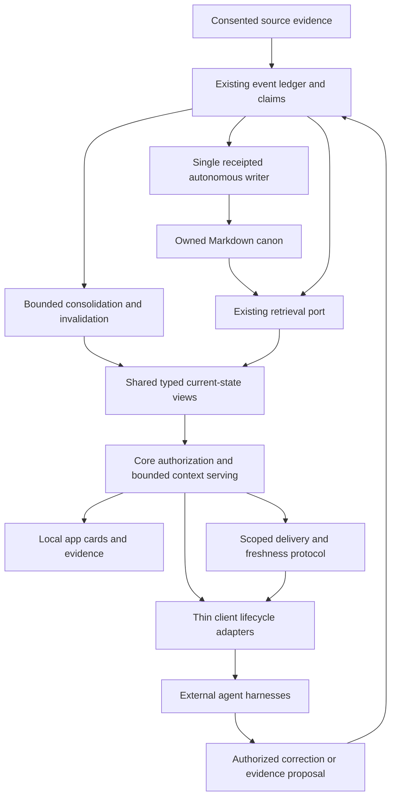

# Deep memory integration programme

Status: implementation programme requested on 6 September 2026. This document
integrates work into the existing roadmap; it is not a shipped-feature claim,
a new binding RFC, a runtime installation, or merge/deployment authority.

Baseline: Kizuki `5e2958fff073bf8ac8ba446d09fc7b38faa3047f`.
Upstream evaluation: `8c70f6255047a7647adb30b1d6333a48068d9fa5`.
Attribution, source evidence and adoption boundaries live in
[upstream policy](upstream-policy.md#integration-evidence-2026-09-06).
The [acceptance charter](retrieval-engine-acceptance.md) defines the proof.

## Outcome and architectural fit

A person can continue meaningful work with another authorized agent without
reconstructing the project. Relevant memory contributes when needed, survives
compaction, follows corrections, exposes uncertainty and remains removable.
Success means less re-explanation and fewer obsolete assumptions, measured
against the current implementation rather than asserted from an upstream score.

Binding authority remains [CURRENT](CURRENT.md), [decisions](decision-log.md)
and [RFC 0002](../rfcs/0002-autonomous-canon.md). Execution is coordinated through
#497; #403 owns release acceptance. Do not add calendar gates. #481 owns RFC
reconciliation, including the distinction between a merged proposal and an
accepted contract. No new numbered RFC or parallel world-state store is created.

The diagram is the intended composition, not a completion map. Every arrow
crossing a component uses its public contract. Clients never open the retrieval
store or write canon. The optional synthesis operation is a bounded read over
permitted evidence, not an autonomous action loop. Any persistence it later
needs must use existing claim/writer authority, never direct page mutation.

## What to reuse instead of rebuilding

At the baseline, the repository already contains the permitted hybrid-ranking
and graph fork under `packages/retrieval-pg/vendor/`, an embedded SQL retrieval
port, scoped MCP/context serving, source consent, correction and agent enrollment.
Read `packages/retrieval-pg/README.md`, [agent enrollment](agent-enrollment.md),
[context privacy](context-privacy.md), [architecture](architecture.md), and
`packages/mcp/test/two-client-continuity.test.ts` before selecting a change.
A package capability does not prove the CLI/MCP has a production model bound.
The retrieval README explicitly distinguishes that composition and its unproven
corpus-scale performance. Do not describe the existing fork as the entire
upstream product or restart provisioning as if it were absent.

Issue #502 was closed by the time of this inspection. Its recorded synthetic
transport and enrollment receipts explicitly leave broader client and semantic
qualification unproved. Preserve that work and its historical state. #527 owns
the new lifecycle follow-on. Do not infer a full Stage A/B acceptance from issue
closure, or reuse historical test counts as a new exact-head receipt.

## Work ownership and traceability

Numbers identify existing GitHub issues unless described as new follow-ons.
A row extends the named lane, not every currently open PR in that lane.

| Track | Concrete adoption | Implementation home | Acceptance cases |
| --- | --- | --- | --- |
| 1. Memory participates in client lifecycle | Session start, bounded volunteered context, compaction recovery, optional consented writeback | #527, following #502; integrate with #458, #489, #490 | L01-L07 |
| 2. Useful understanding | Typed entity/project cards, open threads, evidence and optional cited read-only synthesis | #484, #486, #488, #489, #495 | C01-C07 |
| 3. Changes reach clients | Ordered scoped deltas, delivery acknowledgements, expiry and recovery | #490 over #483/#489 | D01-D07 |
| 4. Better retrieval when justified | Bounded reranking, effective-stage diagnostics, controlled quality fallback | #528; current retrieval/embedding owners and #496 | R01-R07 |
| 5. Memory stays current | Ordered maintenance, durable progress, revision fences and freshness-safe reads | #503 over #482/#483, with existing serve/producer/writer | M01-M07 |
| 6. Quality is measured | Write/read/injection/correction lifecycle fixtures, ablations and real-client proof | #496, starting immediately | E01-E07 |
| 7. Setup proves value | Safe client wiring, capability health, correction round-trip, rollback and uninstall | #458 with #527 and existing enrollment | S01-S07 |

#527 and #528 fill bounded follow-on gaps; they are not replacement epics.
#472/#479 and paused #500 retain foundation ownership. Read live issue comments,
PR paths and exact heads before editing shared schemas or production adapters.

## 1. Client lifecycle and volunteered context

Study upstream evidence U1/U2. Implement one thin lifecycle adapter contract
with explicit capability negotiation. Supported lifecycle events are session
start, a relevant user turn, compaction recovery and optional session end. A
harness lacking a sanctioned hook gets documented pull-mode behavior, not an
invented hook or a patched private provider interface. Qualify each real client
and version independently using current official documentation.

Stage one reuses current context packets and enrollment without waiting for the
whole world model. Stage two consumes #489/#490 after their contracts are
accepted. Neither adapter implements its own compiler, identity store or grants.
The authenticated principal is resolved by Core, never trusted from a request
field. Budgets, source purposes and model-egress consent apply to delivery into
an external client as well as to explicit model calls.

For volunteered context, start deterministic: a bounded recent-turn window,
entity/alias resolution, ambiguity refusal, task relevance and a small
configurable pointer/page limit. Three pages is an initial experiment, not a
published default or calibrated probability. Matching confidence is not claim
truth, evidence authority, identity certainty or permission. Ambiguous references
must not become a guessed dossier. No automatic external enrichment is implied.

Deduplicate by authorized item identity, item revision and delivery episode,
not the appearance of a slug anywhere in arbitrary tool text. An unchanged item
need not repeat every turn; a corrected item must be eligible again. Compaction
rehydrates current permitted decisive constraints and unresolved work. It does
not merely replay an old summary. Apply bounded session retention and reset
semantics without exposing global revisions or inaccessible activity.

Distinguish selected, served, injected, acknowledged and actually used context.
A server response is not proof the host injected it; a later read is only a proxy
for use. Record which signals the host can prove. Keep diagnostics local,
redacted, bounded and disableable; no raw conversation retention by default.
A memory outage may leave the client usable but must report missing/stale context.
A policy failure may never trigger a raw-file fallback.

Optional session-end capture is a separate write-side feature. Require source
consent, stable event/retry identity and exact source lineage. Preserve questions,
proposals and completion self-reports as those kinds, not accomplished facts.
Generated packets and summaries cannot become independent witnesses when
recaptured. Emit through existing ingress; never write pages from a hook.

## 2. Entity cards and cited synthesis

Study U2/U4/U6. Use #482's accepted schema registry and #484/#486/#488's typed
views. A card should expose identity and aliases, current supported state,
relevant open threads, recent change, evidence, conflicts, uncertainty and
coverage. A repeated meeting mention is not an extra commitment. A relationship
co-occurrence is not a causal or directed semantic edge. Homonyms remain distinct.

Provide a useful deterministic card without a model. Human cards and structured
agent responses render the same Core result, with evidence on demand. Do not
construct a second GUI-only people model or infer private motivations as facts.
Tier enrichment by task value and available consent rather than creating a full
page and web-research job for every incidental mention. Any external research
remains explicitly authorized connector/model activity with source lineage.

Optional deeper synthesis belongs behind #489's bounded evidence composition,
not inside every retrieval request. Its conceptual result distinguishes answer,
permitted supporting sources, conflicting evidence, gaps, freshness, model
identity and observed/estimated cost. Exact exported names and errors belong to
the accepted contract; this document registers no new MCP tool.

Missing model, genuine empty evidence, stale evidence, provider failure and a
successful answer must be distinct. An explicitly supported extractive fallback
may quote only permitted retrieved material and identify itself as extractive.
It must not hide a broken configured model or fabricate a complete answer from
an empty gather. Preserve current model-free lookup behavior in every case.

Synthesis is read-only by default. It cannot amend claim authority, silently
persist generated truth, or bypass owner-correction precedence. Newly arrived
contradictions must be reconciled or clearly qualified before an answer is called
current. Coverage statements describe connected evidence, not unobserved reality.

## 3. Scoped change delivery and compaction recovery

Study U2. Reuse #483 revisions/invalidation and #490's future scoped protocol;
current packet-cache invalidation is not a complete semantic change feed.
Changes should describe added, changed, superseded, invalidated or removed
permitted state with exact evidence where it remains accessible.

Prefer the accepted logical-revision order with a stable tie-breaker. The
upstream timestamp-plus-slug keyset is a useful minimum pagination lesson, not
permission to replace Kizuki's stronger temporal model with wall-clock order.
Define a coherent snapshot/high-watermark so changes during pagination cannot
silently fall behind a cursor. Cover pages, claims/facts and open-thread changes:
a cursor advanced on one arm must not drop an undelivered item from another.

Separate a delivered continuation token from any durably acknowledged server
cursor. A lost response must be safely replayable until acknowledged, or use a
stateless caller-supplied continuation with no premature server advance. Budget
truncation and fetch limits return explicit continuation; acknowledge only the
delivered prefix. Retry may redeliver; it may not silently omit. Tombstones and
invalidations participate where policy permits, without resurrecting purged text.

Bind opaque view/cursor tokens to principal, vault, purpose, task/scope, query
contract and applicable policy state. Revalidate on every call and before
response release. Do not expose global revision gaps, restricted counts or
foreign cursor details. An expired or pruned history yields a safe refresh/reset
requirement, never unchanged. Model/consolidation outages cannot look complete.
A grant narrowing invalidates old managed views; Kizuki cannot erase independent
copies already retained by an external client.

## 4. Bounded reranking and truthful retrieval diagnostics

Study U3. #528 first inventories the effective public composition and existing
local model work. D17 retains Kizuki-owned reranking/GGUF; the upstream's actual
reranker is evidence of a pattern, not automatically included source or a license
to extend the permitted fork. The factual correction is in upstream policy.

Retrieve candidates through the existing port, enforce current access and source
consent, then optionally rerank a bounded authorized shortlist. Configuration of
a remote endpoint is not permission to send a local-only source there. Check
query and document egress independently. No automatic cloud fallback.

Cap candidates, per-document and total serialized input, calls, deadlines and
output. Validate indices, finite scores, uniqueness and payload size. Preserve
original evidence IDs, stable tie order and the un-reranked tail. Invalid or
partial scoring has a documented deterministic fallback without inventing scores
or dropping unscored evidence. Provider timeout may degrade ranking; policy or
provenance failure cannot degrade into broader access.

Revalidate policy and content dependencies after inference and before returning
or caching. Revision mismatch cannot reintroduce a superseded claim. A late model
result after deletion, cancellation or purge is discarded. Do not add a query
cache just because the upstream has one. A justified cache must include principal,
scope, purpose, policy/content revisions, model space and configuration, plus
explicit invalidation, retention and physical-removal proof.

Diagnostics expose requested/effective mode, stages actually used, skip/failure
reason, model/space, stage latency, measured or estimated tokens and permitted
result rank changes. No restricted candidate counts, private query text, provider
secrets or raw errors. UI, CLI and MCP project one semantic result. Use matched
ablations before enabling expensive query expansion, reranking or new boosts.

## 5. Maintenance that cannot make current reads stale

Study U5. #503 extends the existing rails, checkpoints, leases, budgets and writer.
A phase plan must express dependencies and parallelism explicitly: capture and
immediate invalidation stay responsive while expensive consolidation catches up.
Do not import a general-purpose worker/subagent scheduler.

Each phase takes bounded source/claim revisions and an applicable policy
snapshot. It returns attempted/committed/skipped counts, remaining eligible work,
checkpoint, consumed revisions, failure/degradation, resource use and receipts
through existing contracts. Availability, partial processing, rejected output and
a genuinely empty successful batch are different outcomes. A checkpoint cannot
advance over unprocessed input because a model was unavailable.

Fence every late commit against current claim/source revisions and grant state.
A correction must win over an older in-flight synthesis. Commit progress and
observable effects through the existing transaction/recovery protocol. Retry is
idempotent. Lease ownership must be checked at effect/commit boundaries; a
heartbeat alone is not fencing. Do not add a second canon mutation path for
citation repair, enrichment or maintenance.

Reads verify dependency freshness. Return a valid view, a bounded supported
current-evidence overlay, or an explicit stale/pending/unavailable result. Do not
pretend to semantically reconcile arbitrary prose without an implemented rule.
Coalesce repeated updates, avoid starving older inputs, and cap batch/token/call/
time/write/concurrency/RSS/storage growth. Safety deletion and invalidation must
not depend on an expensive optional model succeeding.

Physical purge covers derived summaries, embedding/rerank caches where present,
queued payloads, retry inputs, managed delivery state and affected diagnostics.
Content-free receipts remain according to the purge contract. External backups,
Git history and client copies require explicit separate scope. No verified-erasure
claim can mean only logical expiry.

## 6. Evaluation is part of every slice

Study U7 and use #496 rather than a separate quality dashboard. Start with plain
history, lexical retrieval and exact current Kizuki baselines. Add a separately
installed/pinned upstream comparator only in an isolated evaluation environment,
with approved configuration and independently reviewed licenses for fixtures and
models. Never send a private vault to a benchmark service.

Measure the write path, retrieval, injection, compaction, correction and removal.
The acceptance charter supplies a synthetic longitudinal scenario and 49 bounded
cases, not executable tests or results. Existing tests may satisfy individual
cases only with exact-file/head receipts matching their actual scope.

Predeclare corpora, splits, evidence-availability schedule, answer oracle,
model/tokenizer/prompt, budgets, versions, seed, hardware and cold/warm state.
Keep answer keys and future events outside the system under test. Use held-out
quality judgments and report disagreement. Distinguish strict all-evidence recall
from any-hit recall, retrieval from answer correctness, and delivery from use.
Include ingest, consolidation, rerank and retry costs, not just a warm query.

Report cases that fail, are unsupported or unrun. Security/authority breaches,
lost authoritative data, purge resurrection and falsely current stale state are
hard gates. They cannot be averaged away by high recall. Unit tests, synthetic
MCP sessions, real provider clients and unfamiliar-user trials are separate proof
levels. No headline upstream score or timing promise transfers to Kizuki.

## 7. Setup that proves the memory loop

Study U8. #458 owns the local-app workflow; #527 attaches clients through existing
enrollment. Preserve other MCP servers, grants, credentials, application settings
and the standing daemon session. Use reviewable owned-entry diffs, idempotent
install, conditional rollback and uninstall. A concurrent user edit is a conflict,
not permission to restore an entire old config. Credentials remain in supported
secret references and never appear in argv, logs, fixtures or screenshots.

Setup success is a selected source captured, permitted evidence retrieved by a
real authorized client, an evidence reference resolved, and an owner correction
reflected in a later read. Do not invent a mandatory model for this basic journey.
Do not claim an arbitrary supported client completed this without its versioned
receipt. Test cancellation at every durable boundary, repeat install, partial
failure, offline service, unsupported platform and reconnect.

Separate configured, reachable, synthetically verified, live-qualified, recently
exercised and degraded health. A process PID is not a healthy rail, and a saved
hook configuration is not proof a hook ran. Expose only permitted status metadata.
Show capture coverage and model binding honestly. Keep keyboard, narrow-screen,
reduced-motion, evidence inspection, correction and revocation behavior within
the existing local-app acceptance work, not a duplicate UI.

## Delivery order and completion

1. Correct upstream evidence and attach this programme to #497 and its owned
   issues. This documentation step does not enable runtime capabilities.
2. Run #496 baseline/fixture work alongside #527's lifecycle Stage A and #458
   integration. Reuse already merged enrollment and synthetic continuity tests.
3. Extend #484/#486/#488 cards and #489 composition incrementally after the
   necessary shared contracts are accepted. Do not wait for the full Atlas.
4. Build #503 freshness and #483 invalidation alongside those consumers; add
   #490 deltas after its prerequisite view/revision contract exists.
5. Evaluate #528 reranking independently of unrelated ontology work, then expose
   it only where licensed, configured, permission-safe and measurably useful.
6. Qualify optional cited synthesis, wider client lifecycle coverage and the
   complete correction/compaction/purge journey on exact artifacts.

Each implementation PR names owned paths, dependencies, public semantics,
authority, data lifetime, retry/cancellation behavior, resource limits and its
acceptance IDs. Run the pinned toolchain and repository verifier, then independent
specification/security and quality/regression reviews on the exact head. Preserve
unfamiliar work, `.maestro/` and existing PR ownership. Use the current handoff and
relevant canonical skills, particularly `issue-pickup-execution`,
`world-slice-design`, `provenance-invalidation`, `longitudinal-evaluation`,
`dependency-evaluation` and `documentation-accuracy`.

Attach a completion receipt with base/head, changed contracts, commands/results,
case IDs, actual client/platform/model qualification, unresolved limits and
rollback. No issue auto-close, branch push, registry entry, architecture diagram
or test count is a substitute for integrated behavior. A genuinely unsupported
surface remains unadvertised. Merge and deployment remain separate decisions.
